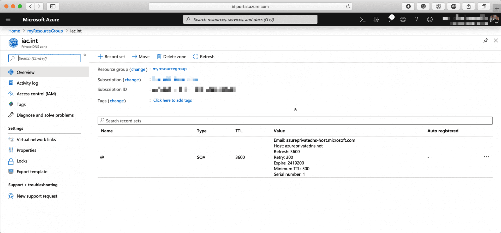
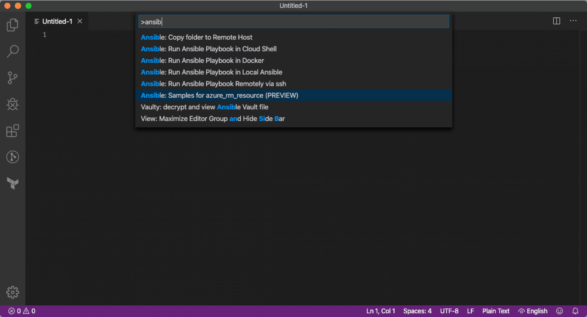
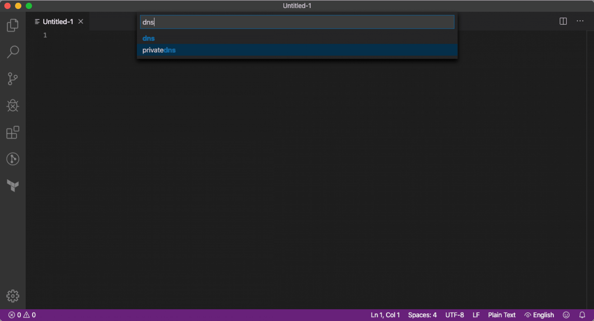
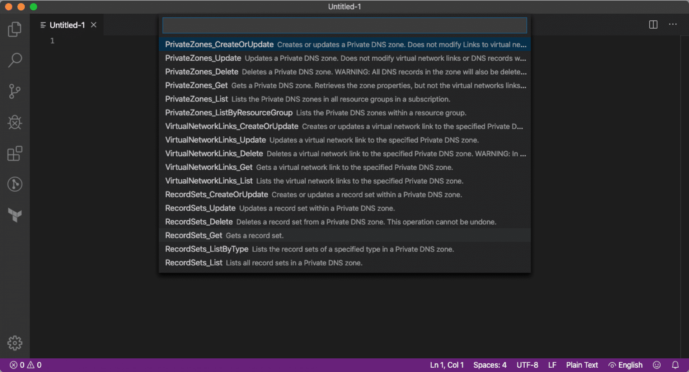
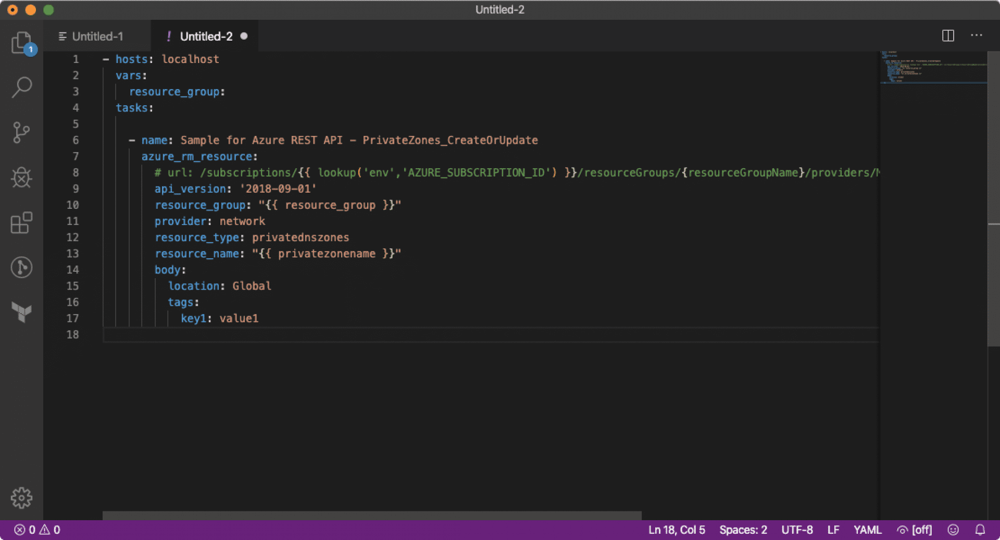

Over the last few months I have been doing more and more work with Ansible to manage end to end deployments in Azure. For the most part Ansible’s core set of Azure modules work with no problems and more than do the job.

However, with the rate which Microsoft are both adding new features and functionality it is difficult to keep up. The core Ansible modules rely on several Azure python libraries to be updated before the functionality can be added or introduced to the core module set.

One work around is to use the set of [preview modules on Ansible Galaxy](https://galaxy.ansible.com/azure/azure_preview_modules) provided by Microsoft. However, being this cutting edge comes with a warning that using them could introduce breaking changes to the core Azure modules due to the preview modules reliance on the updated Python SDK.

Typically I tend to ignore these as a lot of the work I do is for production systems and I don’t want to relay on something which could change, potentially quite dramatically, before it gets merged into the core set of Ansible Azure modules.

Luckily, Ansible 2.6 introduced the `azure_rm_resource` module, this gives you access to create, update or delete any Azure resource using the Azure REST API, this means that if the Azure REST API supports managing the resource / feature you want to interact with then you will now be able to do it directly from Ansible.

Great you maybe thinking to yourself, end of blog post, I will go ahead and use `azure_rm_resource` for all of those bits I have been trying to put work arounds in place for …

… as you can imagine, the Azure REST API is quite complicated and there isn’t much documentation for the module.

#### Using the azure_rm_resource module

So let’s dive in and take a look at how we can use the `azure_rm_resource` and Azure REST API to launch a resource, which at the time of writing, is not supported nativity in the core Azure Ansible modules. For this I am going to look at adding an Azure Private DNS zone and then attach it to a Virtual Network - for more information on Azure Private DNS see [the overview page](https://docs.microsoft.com/en-us/azure/dns/private-dns-overview).

To start with we are going to be needing a resource group and virtual network, for this we will use the core `azure_rm_resourcegroup` , `azure_rm_virtualnetwork` and `azure_rm_subnet` modules as we don't need anything special;


``` yaml
- name: Create a Azure Private DNS zone using Ansible
  hosts: localhost
  connection: local
  gather_facts: true

  vars:
    resource_group: "myResourceGroup"
    location: "uksouth"
    network:
      name: "iac-vnet"
      cidr_block: "10.10.0.0/23"
      subnets:
        - { name: 'app-sub',    subnet: '10.10.0.0/24' }
        - { name: 'gateway-sub',   subnet: '10.10.1.0/27' }
    dnszone: "iac.int"

  tasks:
    - name: Create a resource group
      azure_rm_resourcegroup:
        name: "{{ resource_group }}"
        location: "{{ location }}"

    - name: create virtual network
      azure_rm_virtualnetwork:
        resource_group: "{{ resource_group }}"
        name: "{{ network.name }}"
        address_prefixes: "{{ network.cidr_block }}"

    - name: add the subnets
      azure_rm_subnet:
        resource_group: "{{ resource_group }}"
        name: "{{ item.name }}"
        address_prefix: "{{ item.subnet }}"
        virtual_network: "{{ network.name }}"
      with_items: "{{ network.subnets }}"
```


The next part of the playbook is where things start to get interesting as this is where we are going to be making our first call to the Azure REST API using `azure_rm_resource`;


``` yaml
- name: create a private DNS zone for {{ dnszone }}
      azure_rm_resource:
        api_version: "2018-09-01"
        resource_group: "{{ resource_group }}"
        provider: "network"
        resource_type: "privatednszones"
        resource_name: "{{ dnszone }}"
        body:
          location: "Global"
```


There are few things to unpack here, before we look at each of the parameters in the task do lets quickly look at what the REST API would look like.

First off is the `PUT` request (you may need to scroll to see the full URL), the request contains the subscription ID, resource group and information around the provider to use, which in this case is the `Microsoft.Network/privateDnsZones` one before finally we provide the name of the zone which we would like to be created and the API version to use;


```
PUT https://management.azure.com/subscriptions/xxxxxxxx-xxxx-xxxx-xxxx-xxxxxxxxxxxx/resourceGroups/myResourceGroup/providers/Microsoft.Network/privateDnsZones/iac.int?api-version=2018-09-01
```


The JSON body we would send with the `PUT` request contains the following;


``` json
{
  "location": "Global"
}
```


You can see that a lot of the request above is repeated in the parameters we have supplied in the task;

- `api_version`, here you can specify the version of the API to use, this is useful to maintain compatibility within your tasks.
- `resource_group`, is self explanatory, which resource group would you like the REST API to create the resource in?
- `provider`, the provider to use, this just needs to be the name of the provider and not be prefixed by `Microsoft.`.
- `resource_type`, this is the type of resource we will be creating.
- `resource_name`, the name of the resource we want to create.
- `body`, finally, we have the body of the request.

So far so good, if we wanted to we could run our playbook and the Resource Group, Virtual Network, Subnets and Private DNS Zone would all be created, however, we need a few more steps top register our newly created Private DNS zone with the virtual network.

#### Differences when launching resources using the azure_rm_resource module

This is where one of the main differences between using the core Ansible Azure modules and the Azure REST API rears it head. You will be used to the majority of Ansible modules waiting for resource you are creating to complete creating and gather a bunch of facts about the newly created resource before exiting.

As we are now offloading the creation to of the resource to the Azure REST API the `azure_rm_resource` module only really cares that is making a valid REST request rather than the resource has completed launching. This means we will have add some logic to ensure that our Internal DNS zone have successfully been created before progressing with the registration.

To do this we can use the `azure_rm_resource_info` module, this also interacts with the Azure REST API - but it only performs `GET` requests;


``` yaml
- name: wait for the {{ dnszone }} private dns zone to finish registering before progressing
      azure_rm_resource_info:
        api_version: "2018-09-01"
        resource_group: "{{ resource_group }}"
        provider: "network"
        resource_type: "privatednszones"
        resource_name: "{{ dnszone }}"
      register: dnszone_output
      until: dnszone_output.response[0].code != 'NotFound'
      delay: 10
      retries: 10
      ignore_errors: true
```


As you can see, we are registering the output of the request and retrying it until the registered output doesn’t contain ‘NotFound’, we are also ignoring errors to stop the playbook run from failing on subsequent executions.

#### Let’s do something a little more complex

Now that we know that our Private DNS zone has been created we are almost ready to register it within our Virtual Network. The raw REST API request to do this looks something like the following;


```
PUT https://management.azure.com/subscriptions/xxxxxxxx-xxxx-xxxx-xxxx-xxxxxxxxxxxx/resourceGroups/myResourceGroup/providers/Microsoft.Network/privateDnsZones/iac.int/virtualNetworkLinks/iac.int?api-version=2018-09-01
```


This time the JSON body contains the following;


``` json
{
  "location": "Global",
  "properties": {
    "virtualNetwork": {
      "id": "/subscriptions/xxxxxxxx-xxxx-xxxx-xxxx-xxxxxxxxxxxx/resourceGroups/myResourceGroup/providers/Microsoft.Network/virtualNetworks/iac-vnet"
    },
    "registrationEnabled": true
  }
}
```


As you can see, the body contains more information — one bit of which is a little troublesome. The ID of virtual network requires a little bit of information, we already know the virtual network name and which resource group the virtual network is in, however, we also need to provide the subscription ID.

So far, Ansible has been supplying this for us but now we actually need to include it as a variable within the task, as we want our playbook to be as dynamic as possible we really should be getting this information on the fly.

#### Figure out your Azure Subscription ID using Ansible

This is where I struggled a little bit as most of the fact gather modules I looked didn’t return just the subscription ID, so get around this we are going to use the `azure_rm_resourcegroup_info` module. This returns the full resource ID of the group, this in our case would be something like `/subscriptions/xxxxxxxx-xxxx-xxxx-xxxx-xxxxxxxxxxxx/resourceGroup/myResourceGroup`.

So what we need to do is register the output of running the `azure_rm_resourcegroup_info` module and then using regular expressions grab the subscription ID and set it as a fact using the `set_fact` module;


``` yaml
- name: get facts about our resource group so we can get the subscription id
      azure_rm_resourcegroup_info:
        name: "{{ resource_group }}"
      register: "current_sub_id"

    - name: set the current subscription id using the facts we just grabbed as a variable using some regex
      set_fact:
        sub_id: "{{ current_sub_id.resourcegroups[0].id | regex_findall('^/[^/]+/([^/]*)') | list | join }}"
```


Now that we have subscription ID we can then register our Private DNS with the Virtual Network and allow resources created in there automatically register themselves with the DNS zone;


``` yaml
- name: link {{ dnszone }} to {{ network.name }} and allow registrations
      azure_rm_resource:
        api_version: '2018-09-01'
        resource_group: "{{ resource_group }}"
        provider: network
        resource_type: privatednszones
        resource_name: "{{ dnszone }}"
        subresource:
          - type: virtualnetworklinks
            name: "{{ network.name }}"
        body:
          location: Global
          properties: 
            virtualNetwork: 
              id: /subscriptions/{{ sub_id }}/resourceGroups/{{ resource_group }}/providers/Microsoft.Network/virtualNetworks/{{ network.name }}
            registrationEnabled: true
```


Now that we have everything we need to create the resource we can run the playbook, a recording of which can be found below;

Checking the Azure portal shows that the resource has been created as expected;



That is only half of the story though, remember the task which registers the internal DNS zone with the virtual network — the JSON body which was sent was starting to get a little complicated …


``` yaml
- name: link {{ dnszone }} to {{ network.name }} and allow registrations
      azure_rm_resource:
        api_version: '2018-09-01'
        resource_group: "{{ resource_group }}"
        provider: network
        resource_type: privatednszones
        resource_name: "{{ dnszone }}"
        subresource:
          - type: virtualnetworklinks
            name: "{{ network.name }}"
        body:
          location: Global
          properties: 
            virtualNetwork: 
              id: /subscriptions/{{ sub_id }}/resourceGroups/{{ resource_group }}/providers/Microsoft.Network/virtualNetworks/{{ network.name }}
            registrationEnabled: true
```


… and that was only a basic task, trying to do more complex tasks can result in some quite complicated requests needing to be made.

#### Using Visual Studio Code to get a head start

Luckily, there is a way you can get a head start. Version 0.5.0 of the [Ansible Visual Studio Code extension](https://marketplace.visualstudio.com/items?itemName=redhat.ansible) introduced the `Samples for azure_rm_resource` command, which is in preview. This command does something extremely useful, it downloads a copy of the Azure REST API specification from the [official GitHub repo](https://github.com/Azure/azure-rest-api-specs) and updates them to be formatted for use with the `azure_rm_resource` module.

For example, to get a idea on what we needed to do to create the private DNS zone I opened Visual Studio Code, and selected the `Ansible: Samples for azure_rm_resource (PREVIEW)` command;



Once selected, I search for `DNS`;



Selected `privatedns` which then gave me all of the options around managing an Azure Private DNS zone;



Once I had selected `PrivateZones_CreateOrUpdate` I was given the a list of API versions to choose from, then Visual Studio Code opened a new file and populated it with the same data;




``` yaml
- hosts: localhost
  vars:
    resource_group:
  tasks:

    - name: Sample for Azure REST API - PrivateZones_CreateOrUpdate
      azure_rm_resource:
        # url: /subscriptions/{{ lookup('env','AZURE_SUBSCRIPTION_ID') }}/resourceGroups/{resourceGroupName}/providers/Microsoft.Network/privateDnsZones/{privateZoneName}
        api_version: '2018-09-01'
        resource_group: "{{ resource_group }}"
        provider: network
        resource_type: privatednszones
        resource_name: "{{ privatezonename }}"
        body:
          location: Global
          tags: 
            key1: value1
```


As you can see from the sample data above it is quite easy to follow, also without this tool, performing a complex API request would be extremely difficult as you can see from the task below which creates an Application Gateway;


``` yaml
- hosts: localhost
  vars:
    resource_group:
  tasks:

    - name: Sample for Azure REST API - ApplicationGateways_CreateOrUpdate
      azure_rm_resource:
        # url: /subscriptions/{{ lookup('env','AZURE_SUBSCRIPTION_ID') }}/resourceGroups/{resourceGroupName}/providers/Microsoft.Network/applicationGateways/{applicationGatewayName}
        api_version: '2019-09-01'
        resource_group: "{{ resource_group }}"
        provider: network
        resource_type: applicationgateways
        resource_name: "{{ applicationgatewayname }}"
        body:
          identity: 
            type: UserAssigned
            userAssignedIdentities: 
              /subscriptions/subid/resourceGroups/rg1/providers/Microsoft.ManagedIdentity/userAssignedIdentities/identity1: 
          location: eastus
          properties: 
            sku: 
              name: Standard_v2
              tier: Standard_v2
              capacity: 3
            gatewayIPConfigurations: 
              - name: appgwipc
                properties: 
                  subnet: 
                    id: /subscriptions/subid/resourceGroups/rg1/providers/Microsoft.Network/virtualNetworks/vnet/subnets/appgwsubnet
            sslCertificates: 
              - name: sslcert
                properties: 
                  data: ****
                  password: ****
              - name: sslcert2
                properties: 
                  keyVaultSecretId: https://kv/secret
            trustedRootCertificates: 
              - name: rootcert
                properties: 
                  data: ****
              - name: rootcert1
                properties: 
                  keyVaultSecretId: https://kv/secret
            frontendIPConfigurations: 
              - name: appgwfip
                properties: 
                  publicIPAddress: 
                    id: /subscriptions/subid/resourceGroups/rg1/providers/Microsoft.Network/publicIPAddresses/appgwpip
            frontendPorts: 
              - name: appgwfp
                properties: 
                  port: 443
              - name: appgwfp80
                properties: 
                  port: 80
            backendAddressPools: 
              - name: appgwpool
                properties: 
                  backendAddresses: 
                    - ipAddress: 10.0.1.1
                    - ipAddress: 10.0.1.2
            backendHttpSettingsCollection: 
              - name: appgwbhs
                properties: 
                  port: 80
                  protocol: Http
                  cookieBasedAffinity: Disabled
                  requestTimeout: 30
            httpListeners: 
              - name: appgwhl
                properties: 
                  frontendIPConfiguration: 
                    id: /subscriptions/subid/resourceGroups/rg1/providers/Microsoft.Network/applicationGateways/appgw/frontendIPConfigurations/appgwfip
                  frontendPort: 
                    id: /subscriptions/subid/resourceGroups/rg1/providers/Microsoft.Network/applicationGateways/appgw/frontendPorts/appgwfp
                  protocol: Https
                  sslCertificate: 
                    id: /subscriptions/subid/resourceGroups/rg1/providers/Microsoft.Network/applicationGateways/appgw/sslCertificates/sslcert
                  requireServerNameIndication: false
              - name: appgwhttplistener
                properties: 
                  frontendIPConfiguration: 
                    id: /subscriptions/subid/resourceGroups/rg1/providers/Microsoft.Network/applicationGateways/appgw/frontendIPConfigurations/appgwfip
                  frontendPort: 
                    id: /subscriptions/subid/resourceGroups/rg1/providers/Microsoft.Network/applicationGateways/appgw/frontendPorts/appgwfp80
                  protocol: Http
            urlPathMaps: 
              - name: pathMap1
                properties: 
                  defaultBackendAddressPool: 
                    id: /subscriptions/subid/resourceGroups/rg1/providers/Microsoft.Network/applicationGateways/appgw/backendAddressPools/appgwpool
                  defaultBackendHttpSettings: 
                    id: /subscriptions/subid/resourceGroups/rg1/providers/Microsoft.Network/applicationGateways/appgw/backendHttpSettingsCollection/appgwbhs
                  defaultRewriteRuleSet: 
                    id: /subscriptions/subid/resourceGroups/rg1/providers/Microsoft.Network/applicationGateways/appgw/rewriteRuleSets/rewriteRuleSet1
                  pathRules: 
                    - name: apiPaths
                      properties: 
                        paths: 
                          - /api
                          - /v1/api
                        backendAddressPool: 
                          id: /subscriptions/subid/resourceGroups/rg1/providers/Microsoft.Network/applicationGateways/appgw/backendAddressPools/appgwpool
                        backendHttpSettings: 
                          id: /subscriptions/subid/resourceGroups/rg1/providers/Microsoft.Network/applicationGateways/appgw/backendHttpSettingsCollection/appgwbhs
                        rewriteRuleSet: 
                          id: /subscriptions/subid/resourceGroups/rg1/providers/Microsoft.Network/applicationGateways/appgw/rewriteRuleSets/rewriteRuleSet1
            requestRoutingRules: 
              - name: appgwrule
                properties: 
                  ruleType: Basic
                  priority: 10
                  httpListener: 
                    id: /subscriptions/subid/resourceGroups/rg1/providers/Microsoft.Network/applicationGateways/appgw/httpListeners/appgwhl
                  backendAddressPool: 
                    id: /subscriptions/subid/resourceGroups/rg1/providers/Microsoft.Network/applicationGateways/appgw/backendAddressPools/appgwpool
                  backendHttpSettings: 
                    id: /subscriptions/subid/resourceGroups/rg1/providers/Microsoft.Network/applicationGateways/appgw/backendHttpSettingsCollection/appgwbhs
                  rewriteRuleSet: 
                    id: /subscriptions/subid/resourceGroups/rg1/providers/Microsoft.Network/applicationGateways/appgw/rewriteRuleSets/rewriteRuleSet1
              - name: appgwPathBasedRule
                properties: 
                  ruleType: PathBasedRouting
                  priority: 20
                  httpListener: 
                    id: /subscriptions/subid/resourceGroups/rg1/providers/Microsoft.Network/applicationGateways/appgw/httpListeners/appgwhttplistener
                  urlPathMap: 
                    id: /subscriptions/subid/resourceGroups/rg1/providers/Microsoft.Network/applicationGateways/appgw/urlPathMaps/pathMap1
            rewriteRuleSets: 
              - name: rewriteRuleSet1
                properties: 
                  rewriteRules: 
                    - name: Set X-Forwarded-For
                      ruleSequence: 102
                      conditions: 
                        - variable: http_req_Authorization
                          pattern: ^Bearer
                          ignoreCase: true
                          negate: false
                      actionSet: 
                        requestHeaderConfigurations: 
                          - headerName: X-Forwarded-For
                            headerValue: var_add_x_forwarded_for_proxy
                        responseHeaderConfigurations: 
                          - headerName: Strict-Transport-Security
                            headerValue: max-age=31536000
```


When dealing with a lot of parameters like that you really do need the head start which the `Samples for azure_rm_resource` gives you - I can't tell you the amount of time and hassle the extension has save me so far 😄.

Being able to interact directly with the Azure REST API using a tool such as Ansible a real time saver and let’t you keep up with new features as they are added Microsoft without having to wait for the Azure module authors and SDK to catch-up.