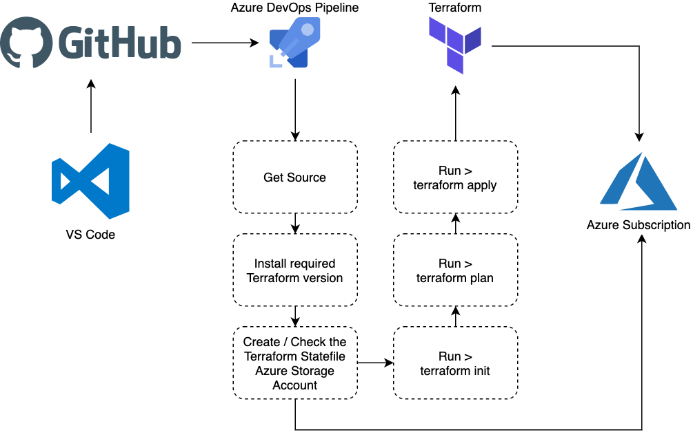

In my [last post](https://www.mediaglasses.blog/2020/05/10/azure-devops-ansible-pipeline/) I wrote about how I created an Azure DevOps pipeline using Ansible in a more “Terraform” way, however, although I have used Terraform and Azure DevOps quite a bit I realised I didn’t really have a template for a pipeline.

Before we look at the pipeline itself I should point out that is uses the the [Terraform Azure Pipeline extension by Microsoft DevLabs ](https://marketplace.visualstudio.com/items?itemName=ms-devlabs.custom-terraform-tasks&ssr=false#overview)from the [Visual Studio Marketplace](https://marketplace.visualstudio.com/azuredevops), if you are following along with this post please ensure that the extension is installed in your organisation before proceeding.

Now we have that out of the way, and before I breakdown the `azure-pipelines.yml` file, lets quickly get an overview of what the tasks which are running in the pipeline;



As you can see from the flow of tasks above I am creating the storage account used to store the Terraform state file as part of the pipeline itself rather than doing manually outside of the pipeline. In nearly all of my Azure DevOps pipelines I see the following variable as `SUBSCRIPTION_NAME` which contains the name of the service connection that should be used to connect to Azure, wherever you see `$(SUBSCRIPTION_NAME)` in the following tasks that is referring to the service connection.

The `azure-pipelines.yml` file starts of by defining the trigger, in this case it is triggered each time something is pushed to the master branch:

``` yaml
trigger:  - master
```

Next, I define some variables, apart from `tf_version` which fines which version of Terraform I want to install the rest are to do with the Terraform statefile resources which need to be configured before I run Terraform:

``` yaml
variables:
  tf_version: "0.12.26" # what version of terraform should be used
  tf_state_rg: "blogpost-tfstate-rg" # name of the resource group to create/use for the terraform state file
  tz_state_location: "uksouth" # location of the resource group to create/use for the terraform state file
  tf_state_sa_name: "blogposttfstatesa" # name of of the storage account to create/use for the terraform state file
  tf_state_container_name: "tfstate" # name of of the container to create/use for the terraform state file
  tf_state_tags: ("env=blogpost-terraform-devops-pipeline" "deployedBy=devops") # tags for the resources above which support tagging
  tf_environment: "dev" # enviroment name, used for the statefile name
```

Then we decide on the image used for the pipeline run, as you may have guessed, I am using Linux:

``` yaml
pool:
  vmImage: "ubuntu-latest"
```

Now that the basics for the pipeline are covered I can start to define some tasks, beginning with installing Terraform:

``` yaml
steps:
  - task: terraformInstaller@0
    displayName: "Install Terraform $(tf_version)"
    inputs:
      terraformVersion: "$(tf_version)"
```

As you can see, I am using the `terraformInstaller@0` task from the Terraform DevOps extension along with the `$(tf_version)` which was defined at the top of the file. Now that Terraform is installed I need to either create the storage account, or if it already exists gather some facts. To do this I am using the `AzureCLI@2` task:

``` yaml
- task: AzureCLI@2
    displayName: "Create/Check the Terraform Statefile Azure Storage Account"
    inputs:
      azureSubscription: "$(SUBSCRIPTION_NAME)"
      addSpnToEnvironment: true
      scriptType: "bash"
      scriptLocation: "inlineScript"
      inlineScript: |
        TAGS=$(tf_state_tags)
        az group create --name $(tf_state_rg) --location $(tz_state_location) --tags "${TAGS[@]}"
        az storage account create --resource-group $(tf_state_rg) --name $(tf_state_sa_name) --sku Standard_GRS --encryption-services blob --tags "${TAGS[@]}"
        ACCOUNT_KEY=$(az storage account keys list --resource-group $(tf_state_rg) --account-name $(tf_state_sa_name) --query [0].value -o tsv)
        az storage container create --name $(tf_state_container_name) --account-name $(tf_state_sa_name) --account-key $ACCOUNT_KEY
        echo "##vso[task.setvariable variable=tf_state_sa_key]$ACCOUNT_KEY"
```

As you can see I am running a quite a few commands, these do the following:

1. Sets an environment variable containing the tags defined in the pipeline variables
2. Creates a Resource Group and tags it
3. Creates the Azure Storage Account and tags it
4. Sets an environment variable containing the Storage Account key
5. Creates a container in the Azure Storage Account which has just been created using the key gathered in the previous step
6. Adds the Azure Storage Account key as a pipeline variable so that we can use it in the next task

If the Resource Group, Azure Storage Account and container already exist then we still need the Azure Storage Account key so this task needs to be executed during each pipeline run as the following task needs to interact with the Azure Storage account:

``` yaml
- task: TerraformTaskV1@0
    displayName: "Run > terraform init"
    inputs:
      command: "init"
      backendServiceArm: "$(SUBSCRIPTION_NAME)"
      backendAzureRmResourceGroupName: "$(tf_state_rg)"
      backendAzureRmStorageAccountName: "$(tf_state_sa_name)"
      backendAzureRmContainerName: $(tf_state_container_name)
      backendAzureRmKey: "$(tf_environment).terraform.tstate"
```

Here I am running `terraform init` and passing all of the variables which tell Terraform how to configure the AzureRM backend service with the details of the Azure Storage account I configured in the previous task. Once the `terraform init` has been executed we do not need to pass the AzureRM backend service details again. The final two tasks `plan` and `apply` the Terraform configuration:

```yaml
- task: TerraformTaskV1@0
    displayName: "Run > terraform plan"
    inputs:
      command: "plan"
      environmentServiceNameAzureRM: "$(SUBSCRIPTION_NAME)"

  - task: TerraformTaskV1@0
    displayName: "Run > terraform apply"
    inputs:
      command: "apply"
      environmentServiceNameAzureRM: "$(SUBSCRIPTION_NAME)"
```

As you can see I am providing rather than using `backendServiceArm` I am using `environmentServiceNameAzureRM`, this means that if I wanted I could store my Terraform statefile(s) in a completely separate Azure Subscription from where I am deploying my resources should I want to.

The Terraform files themselves in this project are pretty boring as I don’t want it to do anything exciting, the `main.tf` looks like the following:

``` hcl
# Setup
######################################################################################################

# What is the minimum version of Terraform we need?
terraform {
  required_version = ">= 0.12.0"
  backend "azurerm" {}
}

# https://registry.terraform.io/providers/hashicorp/azurerm/
provider "azurerm" {
  version = "=2.0"
  features {}
}

# Create the resource group
######################################################################################################
resource "azurerm_resource_group" "resource_group" {
  name     = "test-terraform-pipeline-rg"
  location = "uksouth"
  tags     = merge(var.default_tags, map("type", "resource"))
}
```

With the `variables.tf` looking like:

``` hcl
variable "default_tags" {
  description = "The defaults tags, we will be adding to the these"
  type        = map
  default = {
    project        = "devops-pipeline-test"
    environment    = "dev"
    deployed_using = "terraform"
  }
}
```

The pipeline run looks like the following:

<div class-="gallery-box">
  <div class="gallery">
    <image src="images/02.png">
    <image src="images/03.png">
    <image src="images/04.png">
    <image src="images/05.png">
    <image src="images/06.png">
  </div>
</div><br>

You can find the repo containing all of the code above at [https://github.com/russmckendrick/DevOpsTerraformPipeline](https://github.com/russmckendrick/DevOpsTerraformPipeline).
