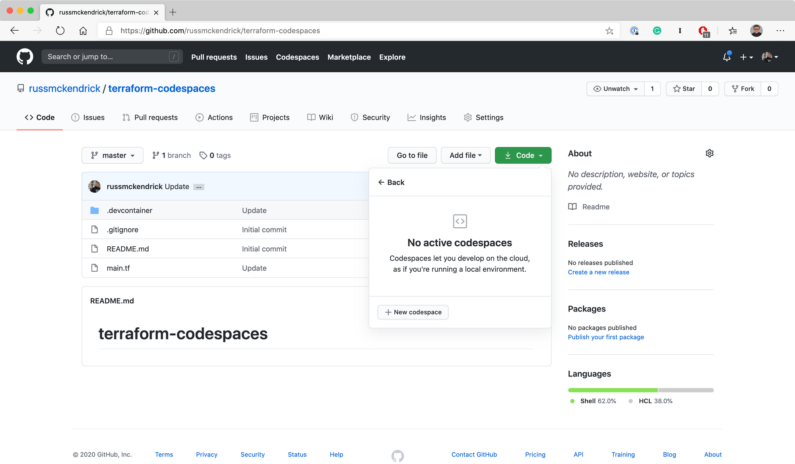
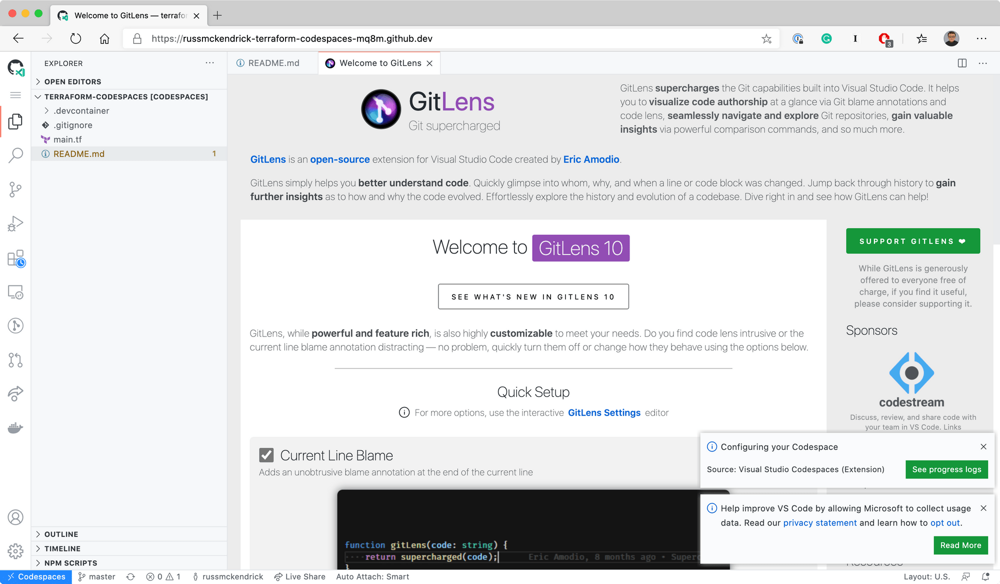
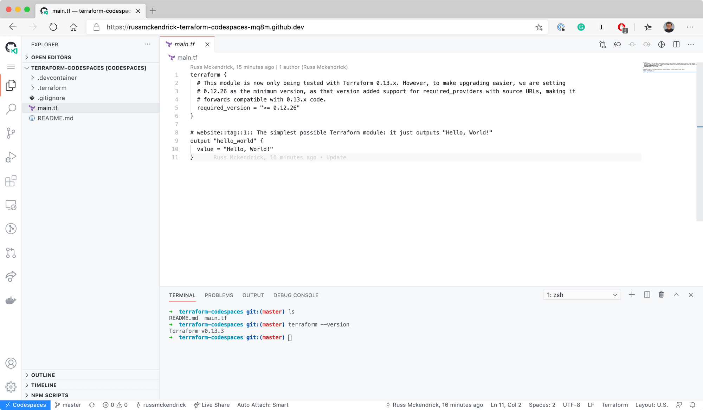

I got my invite for GitHub Codespaces the other day and I thought I would have a quick play with it as having an an online IDE sounds like it could come in handy.

If you know me — you will know that I am not a developer, but I do a lot of work in Visual Studio Code as that is where I tend to develop work on a lot of the infrastructure as code projects using Terraform and Ansible, as well as Docker projects.

I as didn’t have long, I decided to create a repo which would contain nothing more than a Hello World Terraform script — this looks something like the following:


``` hcl
terraform {
  # This module is now only being tested with Terraform 0.13.x. However, to make upgrading easier, we are setting
  # 0.12.26 as the minimum version, as that version added support for required_providers with source URLs, making it
  # forwards compatible with 0.13.x code.
  required_version = ">= 0.12.26"
}

# website::tag::1:: The simplest possible Terraform module: it just outputs "Hello, World!"
output "hello_world" {
  value = "Hello, World!"
}
```


Once the `main.tf` file was in place I created a folder called `.devcontainer` and then added two files, `devcontainer.json` and `post-install.sh`. The first file is pretty basic and contains the settings the for the workspace as well the trigger to execute the `post-install.sh` script.


```json
{
  "name": "terraform-codespaces",
  "settings": {
    "terminal.integrated.shell.linux": "/bin/zsh"
  },
  "extensions": [
    "eamodio.gitlens",
    "davidanson.vscode-markdownlint",
    "hashicorp.terraform",
    "ms-azuretools.vscode-docker"
  ],
  "postCreateCommand": "/bin/bash ./.devcontainer/post-install.sh"
}
```


As you can see, I am installing a few extensions and setting the integrated Terminal to use ZSH rather than the Bash — which is the default. The reason for this is that my [dotfiles](https://github.com/russmckendrick/dotfiles) repository will be loaded by default and that is now focused on ZSH as that is the default shell on macOS now.

The last line runs a small bash script called `post-install.sh` which will install a few bits of useful software as well as Terraform:


``` bash
#!/bin/sh

DEBIAN_FRONTEND=noninteractive
sudo apt-get update
sudo apt-get install -y --no-install-recommends apt-utils dialog dnsutils httpie wget unzip curl jq
DEBIAN_FRONTEND=dialog

getLatestVersion() {
LATEST_ARR=($(wget -q -O- https://api.github.com/repos/hashicorp/terraform/releases 2> /dev/null | awk '/tag_name/ {print $2}' | cut -d '"' -f 2 | cut -d 'v' -f 2))
for ver in "${LATEST_ARR[@]}"; do
  if [[ ! $ver =~ beta ]] && [[ ! $ver =~ rc ]] && [[ ! $ver =~ alpha ]]; then
    LATEST="$ver"
    break
  fi
done
echo -n "$LATEST"
}

VERSION=$(getLatestVersion)

cd ~
wget "https://releases.hashicorp.com/terraform/"$VERSION"/terraform_"$VERSION"_linux_amd64.zip"
unzip "terraform_"$VERSION"_linux_amd64.zip"
sudo install terraform /usr/local/bin/
```


As you can see, it is mostly straight forward with the only complicated bit being the part of the script which figures out the latest version of Terraform from the API and then downloads and installs it.

Once committed I opened GitHub and in using the dropdown menu in the **Code** button selected **Open with Codespaces**, then clicked on **+New codespace**.



After a minute or two I was presented with the following page:



After closing the two files which were opened and dismissing the messages I opened the `main.tf` file and also opened a Terminal, as you can see from the screen below ZSH was selected by default and the latest version of Terraform was installed:


The final thing to do was run the Terraform script, to do this I ran:


``` terminfo
terraform init
terraform plan
terraform apply
```


As expected, I got the immortal words **“Hello, World!”**:



In all, it was a really nice experience the process of setting up a Codespaces workspace for the repo was very easy. I think that I will be including a `.devcontainer` folder and supporting files for a lot of my repos and projects from now on. If you want to clone the repo used in this blog post you can find it at [https://github.com/russmckendrick/terraform-codespaces](https://github.com/russmckendrick/terraform-codespaces).