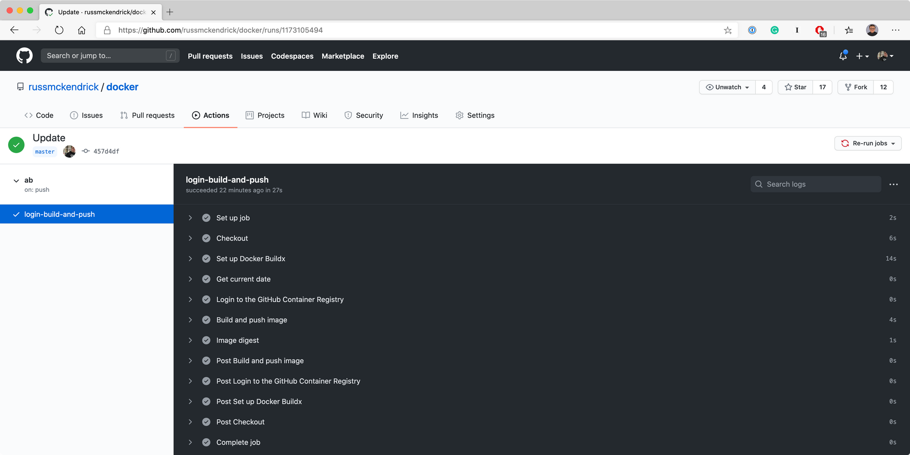

A few weeks after the final draft of the [fourth edition of Mastering Docker ](https://www.packtpub.com/product/mastering-docker-fourth-edition/9781839216572)was submitted Docker made the announcement that they would be making changes to the retention of images in Docker Hub as well as the introduction of rate limits.

These changes make complete sense given that at the time of writing this post there are over 150 million images taking up over 15 PB of storage, of that 10 PB of the images haven’t been accessed in over 6 months and 4.5 PB are associated with free Docker Hub accounts — so removing these inactive images is going to give them a hell of cost-saving.

A few weeks after Docker’s announcement, GitHub made their own announcement, the public beta of GitHub Container Registry. This is the natural evolution of how container images are handled in GitHub Packages as you can now publish public images for free.

I have had the repo which has hosted the Dockerfiles for my containers since [May 2014](https://github.com/russmckendrick/docker/tree/46fd99fff11cc6f03fe2ef89d2f0aa4deb2f7af5) which is linked to my Docker Hub account and as some of my images haven’t been touched in quite a while I thought it was time to move them.

To do this I would need to update all of my Dockerfiles and also create a GitHub Action for each of the container images.

The first part would be easy, lets look at the Dockerfile for Apache Bench:


```Dockerfile
### Dockerfile
#
#   See https://github.com/russmckendrick/docker

FROM ghcr.io/russmckendrick/base:latest

LABEL org.opencontainers.image.authors "Russ McKendrick <russ@mckendrick.io>"
LABEL org.opencontainers.image.source "https://github.com/russmckendrick/docker"
LABEL org.opencontainers.image.description "Apache Bench container, see this containers GitHub repo for more info"

RUN apk add  -U apache2-utils
RUN rm -rf /var/cache/apk/*
```


As you can see, I am using my own base image which is hosted at `ghcr.io/russmckendrick/base:latest`, I am also using the OpenContainer annotation keys as some of these are supported by the GitHub Container Registry, like `org.opencontainers.image.source`, having this defined in the image will automatically link the back to the repo which means the `README` file will be imported at build time.

The rest of the Dockerfile is straight forward and hasn’t changed from when I was using it for Docker Hub.

Now that the Dockerfile has been updated I needed to create a GitHub Action to build and push my images whenever the Dockerfile was updated, however, as the repo contains all of my Dockerfiles in separate folders I would need to ensure that I didn’t build and push every image each time that the repo was updated.

To get around this I created an individual workflow for each container, for example for Apache Bench I created the following YAML file at [`.github/workflows`](https://github.com/russmckendrick/docker/tree/master/.github/workflows):


```yaml
name: ab
on:
  push:
    branches: master
    paths:
      - '!**'
      - 'ab/**'
jobs:
  login-build-and-push:
    runs-on: ubuntu-latest
    steps:
      -
        name: Checkout
        uses: actions/checkout@v2
      -
        name: Set up Docker Buildx
        uses: docker/setup-buildx-action@v1
        with:
          driver-opts: image=moby/buildkit:master
      - 
        name: Get current date
        id: date
        run: echo "::set-output name=date::$(date +'%Y%m%d%H%M')"
      -
        name: Login to the GitHub Container Registry
        uses: docker/login-action@v1
        with:
          registry: ghcr.io
          username: ${{ github.repository_owner }}
          password: ${{ secrets.GHCR_TOKEN }}
      - 
        name: Build and push image
        id: docker_build
        uses: docker/build-push-action@v2
        with:
          push: true
          context: ./${{ github.workflow }}/
          file: ./${{ github.workflow }}/Dockerfile
          tags: |
            ghcr.io/${{ github.repository_owner }}/${{ github.workflow }}:latest
            ghcr.io/${{ github.repository_owner }}/${{ github.workflow }}:${{ steps.date.outputs.date }}
      -
        name: Image digest
        run: echo ${{ steps.docker_build.outputs.digest }}
```


There are a few things to discuss so I will start from the top and break down the file in a little more detail, starting with the name:


``` yaml
name: ab
```


Now that my look simple, but, I named each of the workflows after the folder where the Dockerfile is hosted within my repo, this meant that I could use the `${{ github.workflow }}` variable within the job definitions so I didn't have to hardcode anything outside of the following:


``` yaml
on:
  push:
    branches: master
    paths:
      - '!**'
      - 'ab/**'
```


This section defines when the workflow should be triggered, here I am doing it whenever the main branch is pushed to — but only if any of the files in the `ab` folder changes. To do this I am using two paths, the first `!**` tells the workflow to ignore all changes to everything apart from the include folder which is defined as `ab/**`, unfortunately I can't use the `${{ github.workflow }}` here as at this point in the workflow the it hasn't been started so I can use variables meaning I have to hardcode the path.

Moving on to the actual build, there is a single job called `login-build-and-push`, as you may have guessed - this does all of the work:


``` yaml
jobs:
  login-build-and-push:
    runs-on: ubuntu-latest
```


The first step is common to all workflows and checks out the repo:


``` yaml
      -
        name: Checkout
        uses: actions/checkout@v2
```


The next step does the setup of Docker Buildx using the [action provided by Docker](https://github.com/docker/setup-buildx-action) themselves:


``` yaml
      -
        name: Set up Docker Buildx
        uses: docker/setup-buildx-action@v1
        with:
          driver-opts: image=moby/buildkit:master
```


“Docker Buildx” you might be thinking to yourself, what's that? This is a Docker CLI plugin which extends the build functionality of Docker using BuildKit, it introduces the following features:

- Full BuildKit capabilities with container driver
- Multiple builder instance support
- Multi-node builds for cross-platform images
- Compose build support
- High-level build constructs (bake)
- In-container driver support (both Docker and Kubernetes)

The reason why I am using it as I want to tag each image twice, once with `latest` and also once with the build date and time. There is a known issue where you will receive an **Unexpected status: 401 Unauthorized** error if you try and push more than one tag which we are doing in step #5.

In the next step I am getting the current date and time, then setting it as an output variable so I can use it on step #5:


``` yaml
      - 
        name: Get current date
        id: date
        run: echo "::set-output name=date::$(date +'%Y%m%d%H%M')"
```


Now we are at the point where we are ready to login to the GitHub Container Registry service:


``` yaml
      -
        name: Login to the GitHub Container Registry
        uses: docker/login-action@v1
        with:
          registry: ghcr.io
          username: ${{ github.repository_owner }}
          password: ${{ secrets.GHCR_TOKEN }}
```


As you can see, I am logging to `ghcr.io`, which is the registry URL, as me using the `${{ github.repository_owner }}` variable. The password is a Personal Access Token (PAT) which has the following permissions:

- delete:packages
- read:packages
- write:packages
- repo

The token is then stored in an encrypted secret called `GHCR_TOKEN`. For details on how to create a PAT click [here](https://docs.github.com/en/free-pro-team@latest/github/authenticating-to-github/creating-a-personal-access-token) and for more encrypted secrets see [here](https://docs.github.com/en/free-pro-team@latest/actions/reference/encrypted-secrets).

Now that I am logged in I can build and push my the two tagged images using step #5:


``` yaml
      - 
        name: Build and push image
        id: docker_build
        uses: docker/build-push-action@v2
        with:
          push: true
          context: ./${{ github.workflow }}/
          file: ./${{ github.workflow }}/Dockerfile
          tags: |
            ghcr.io/${{ github.repository_owner }}/${{ github.workflow }}:latest
            ghcr.io/${{ github.repository_owner }}/${{ github.workflow }}:${{ steps.date.outputs.date }}
```


This is where the `${{ github.workflow }}` variable comes into play, here I am using to define both the working directory (`context`) and also the path to the Dockerfile (`file`) as well as in combination with the `${{ github.repository_owner }}` variable to generate the two tags I want to push.

Once pushed, the final step runs and this just outputs some images on the image which has just been pushed:


``` yaml
      -
        name: Image digest
        run: echo ${{ steps.docker_build.outputs.digest }}
```


After checking in the changes it triggered the build as expected and you see the output below:



Once pushed I was able to run Apache Bench by running the following commands:


``` bash
docker run --link=web ghcr.io/russmckendrick/ab ab -k -n 10000 -c 16 http://web/
```


Running the containers


I then repeated this process for the rest of my images, you can find the full repo at [https://github.com/russmckendrick/docker/](https://github.com/russmckendrick/docker/) with the workflow files at [https://github.com/russmckendrick/docker/tree/master/.github/workflows](https://github.com/russmckendrick/docker/tree/master/.github/workflows) and finally, the resulting images are at [https://github.com/russmckendrick?tab=packages](https://github.com/russmckendrick?tab=packages).

For more details on the changes to Docker Hub see the following blog posts:

- [https://www.docker.com/blog/scaling-dockers-business-to-serve-millions-more-developers-storage/](https://www.docker.com/blog/scaling-dockers-business-to-serve-millions-more-developers-storage/)
- [https://www.docker.com/blog/scaling-docker-to-serve-millions-more-developers-network-egress/](https://www.docker.com/blog/scaling-docker-to-serve-millions-more-developers-network-egress/)

The announcement for GitHub Container Registry is at:

- [https://github.blog/2020-09-01-introducing-github-container-registry/](https://github.blog/2020-09-01-introducing-github-container-registry/)

Finally, Mastering Docker — Fourth Edition:


This is available from [Packt Publishing](https://www.packtpub.com/product/mastering-docker-fourth-edition/9781839216572).
