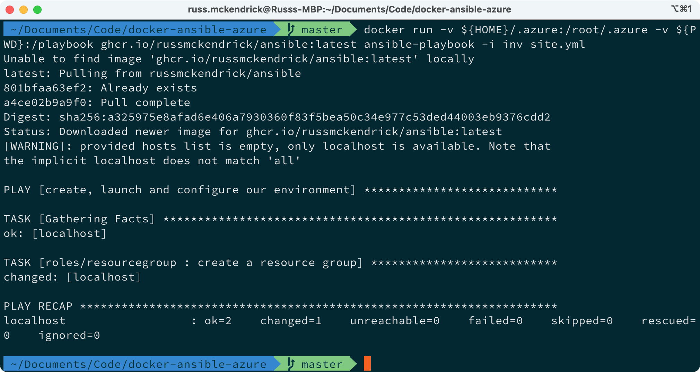
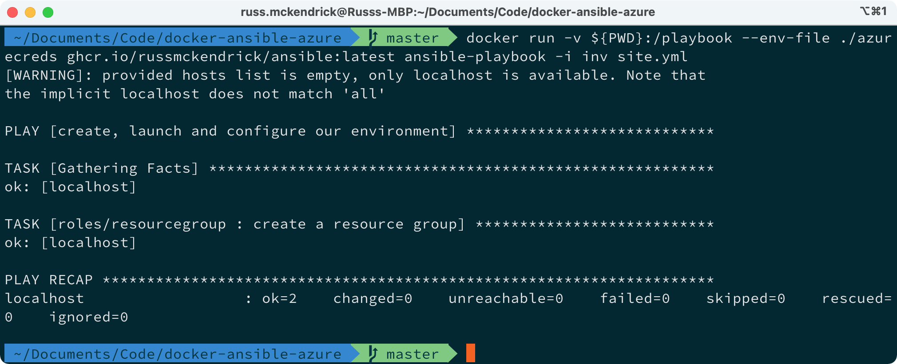
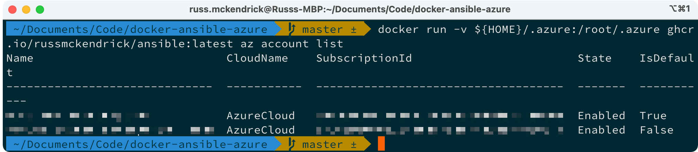

One of the annoying things about updating to the latest version of macOS is that a lot of the command-line tools I use tend to break or need tweaking slightly from how I have been using them.

One of the annoyances in the move to Big Sur is that Python is a back to being a massive pain, and more so than normal. At the time of writing [pyenv](https://github.com/pyenv/pyenv) is not running all that well, and while there are fixes available they slow down my shell — for more information on the problem see this [GitHub issue](https://github.com/pyenv/pyenv/issues/1643) and for information on why pyenv see my previous [post on updating Python on macOS](https://www.mediaglasses.blog/2019/12/29/upgrade-python-on-macos/).

Now normally in the situation I fallback on using [Homebrew](https://www.brew.sh/), however, with the changes to the way in Ansible are shipping their module collections make using Ansible and Homebrew just as complicated — so it was at this point I decided to practice what I preach and create a Docker Container which has everything I needed to run Ansible and the Ansible Azure Collection.

For those of you that don’t care about the how and just want to use if then you can run the following commands, first, if you have the Azure CLI installed and configured locally, then you can run the command below to mount your Azure CLI configuration within the container …


```
docker run \
	-v ${HOME}/.azure:/root/.azure \
	-v ${PWD}:/playbook \
	ghcr.io/russmckendrick/ansible:latest \	ansible-playbook -i inv site.yml
```


As you can see, it is to mount `${HOME}/.azure` into the container and then also the current working directory into `/playbook` within the container. Then we are running the command `ansible-playbook -i inv site.yml` to run the playbook, running the command gives the following output …



As you can see, the image downloaded and the playbook as expected, in this case it was the sample playbook I have shipped in the [image’s repo](https://github.com/russmckendrick/docker-ansible-azure).

The next option for running Ansible using the image is to pass in your credentials as environment variables, as we don’t these to appear in our command history you can use a variables file, which looks something like the following …


```
AZURE_CLIENT_ID=yourClientId
AZURE_SECRET=yourClientSecret
AZURE_TENANT=yourTenantId
AZURE_SUBSCRIPTION_ID=yourSubscriptionId
```


Once you have the file, call it `azurecreds` and run the following command …


```
docker run \
	-v ${PWD}:/playbook \
	--env-file ./azurecreds \
	ghcr.io/russmckendrick/ansible:latest \	ansible-playbook -i inv site.yml
```


The command is pretty much intact from the last one, however, this time we are using the `--env-file` flag rather than mounting `${HOME}/.azure`, running it should give similar output to before …



That is about all you need to know to the image, however, if you need to check connectivity to Azure when using `${HOME}/.azure` then you can run the following command …


```
docker run \
	-v ${HOME}/.azure:/root/.azure \
	ghcr.io/russmckendrick/ansible:latest \
	az account list
```


This should list the accounts connected with your user …



For those that interested the Dockerfile for the image can be found below …


```
FROM alpine:latestLABEL maintainer="Russ McKendrick <russ@mckendrick.io>"
LABEL org.opencontainers.image.source https://github.com/russmckendrick/docker-ansible-azure/
LABEL org.opencontainers.image.description "Docker Image which runs Ansible, the Azure Collection and the Azure CLI, see the repo for more information"
RUN apk update && apk upgrade && \
        apk add bash py3-pip && \
        apk add --virtual=build gcc libffi-dev musl-dev openssl-dev python3-dev make && \
        pip --no-cache-dir install -U pip && \
        pip install azure-cli && \
        pip install -r https://raw.githubusercontent.com/ansible-collections/azure/dev/requirements-azure.txt && \
        pip install ansible && \
        ansible-galaxy collection install azure.azcollection && \
        apk del --purge build && \
        mkdir /playbookWORKDIR /playbookCMD [ "ansible-playbook", "--version" ]
```


… and as per [my last blog post](https://www.mediaglasses.blog/2020/09/27/migrating-my-docker-images-to-the-github-container-registry/), I am hosting the image in the [GitHub Container Registry](https://docs.github.com/en/free-pro-team@latest/packages/guides/about-github-container-registry) as a public image.

You can find the image at [https://github.com/users/russmckendrick/packages/container/package/ansible](https://github.com/users/russmckendrick/packages/container/package/ansible).
