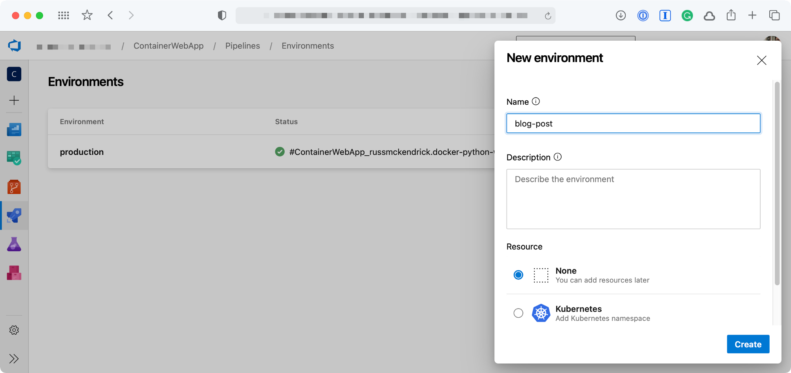

As I move into using Azure DevOps more and more, there is one thing which I really haven’t got on with and that is release pipelines. I didn’t like that I couldn’t easily define it as YAML like I could with build pipelines, even though I don’t like them, there are a few things I do like — like approval gates.

#### Environments

Luckily, there are ways to get around this — the most simple way is to add an Environment and then add an Approval. Adding an Environment is simple enough, just click on Environment in your Pipeline and then add one with None selected under Resource;



Once you have added the Environment you can then add an approval check, to do this click on the Environment you have just created and click on the three dots in the top right-hand side of the page. From the menu select Approvals and checks;


    
    


Now we have an Environment and the Approval in place we can move onto the Pipeline.

#### Pipeline

I already had a multi-stage pipeline I have been using to demo a container build, so I decided to adapt that as it made sense to slot in an approval at the stage where our container image is built, tagged and pushed, there are a few stages before that though so lets take a quick look at those.

First up is the stage where the Resource Group is created;


``` yaml
- stage: "SetupRG"
    displayName: "Resource Group"
    jobs:
      - job: "CreateResourceGroup"
        displayName: "Resource Group - Setup"
        steps:
          - task: AzureCLI@2
            inputs:
              azureSubscription: "$(SUBSCRIPTION_NAME)"
              addSpnToEnvironment: true
              scriptType: "bash"
              scriptLocation: "inlineScript"
              inlineScript: |
                az group create --name $(APP_NAME)-rg --location $(LOCATION)
            displayName: "Resource Group - Use Azure CLI to setup or check"
```


As you can see, I am using the Azure CLI and variables which are defined in the header of the Pipeline.

Once the Resource Group has been created the next stage launches an Azure Container Registry if one doesn’t exist, if there is already one there then nothing happens;


``` yaml
- stage: "SetupACR"
    displayName: "Azure Container Registry"
    dependsOn:
      - "SetupRG"
    jobs:
      - job: "SetupCheckAzureContainerRegistry"
        displayName: "Azure Container Registry - Setup"
        variables:
          - name: "DECODE_PERCENTS"
            value: true
        steps:
          - task: AzureCLI@2
            inputs:
              azureSubscription: "$(SUBSCRIPTION_NAME)"
              addSpnToEnvironment: true
              scriptType: "bash"
              scriptLocation: "inlineScript"
              inlineScript: |
                ACR_ID=$(az acr show --resource-group $APP_NAME-rg --name $ACR_NAME --query "id" -o tsv)
                if [ -z "$ACR_ID" ]; then
                  echo "There is no Azure Container Registry, we should sort that"
                  az acr create --resource-group $(APP_NAME)-rg --name $(ACR_NAME) --sku Basic --admin-enabled true
                else
                  echo "There is already an Azure Container Registry, we don't need to do anything else here"
                fi
            displayName: "Azure Container Registry - Use Azure CLI check or setup"
```


Now that we have a container registry to push our image to we can build and the push the container, this is the stage where we will be getting approval before building;


``` yaml
- stage: "BuildContainer"
    displayName: "Build, Tag and Push the container image"
    dependsOn:
      - "SetupACR"
    jobs:
      - deployment: BuildPushImage
        displayName: "Build, tag and push the image"
        environment: "production"
        pool:
          vmImage: "Ubuntu-20.04"
        strategy:
          runOnce:
            deploy:
              steps:
                - checkout: self
                - task: AzureCLI@2
                  inputs:
                    azureSubscription: "$(SUBSCRIPTION_NAME)"
                    addSpnToEnvironment: true
                    scriptType: "bash"
                    scriptLocation: "inlineScript"
                    inlineScript: |
                      export THETIMEANDDATE=$(date '+%Y-%m-%d-%H%M')
                      echo "$THETIMEANDDATE will be the point in time tag"
                      az acr login --name $(ACR_NAME) 
                      docker image build -t $(IMAGE_NAME) ./
                      docker image tag $(IMAGE_NAME) $(ACR_NAME).azurecr.io/$(IMAGE_NAME):latest
                      docker image tag $(IMAGE_NAME) $(ACR_NAME).azurecr.io/$(IMAGE_NAME):$THETIMEANDDATE
                      docker image push $(ACR_NAME).azurecr.io/$(IMAGE_NAME):latest 
                      docker image push $(ACR_NAME).azurecr.io/$(IMAGE_NAME):$THETIMEANDDATE
                  displayName: "Use Azure CLI to build and push the container image"
```


As you can see, rather than defining a `job` we are using a `deployment` this means we can then use the `environment` we created and because the `environment` is what our approval is attached to the deployment won’t progress until approved.

One thing to note here is that there are two steps, the first `checkout` step downloads a copy of the repo which our `azure-pipelines.yml` and `Dockerfile` are in, without this step the build would fail.

The second step builds, tags and then pushes the image to the Azure Container Registry launched in the previous stage.

The remaining stage, assuming the previous three stages have all completed, configures and launches an App Service Plan, App Service and then configures automatic deployment of any subsequent images which are pushed to our Azure Container Registry, as you can see the code below the steps are only executed if the App Service Plan has not been configured, if our Application is already running then these steps are skipped;


``` yaml
- stage: "SetupAppServices"
    displayName: "Azure App Services"
    dependsOn:
      - "SetupRG"
      - "SetupACR"
      - "BuildContainer"
    jobs:
      - job: "CheckForAppServicePlan"
        displayName: "App Service Plan - Check if App Service Plan exists"
        steps:
          - task: AzureCLI@2
            inputs:
              azureSubscription: "$(SUBSCRIPTION_NAME)"
              addSpnToEnvironment: true
              scriptType: "bash"
              scriptLocation: "inlineScript"
              inlineScript: |
                APP_SERVICE_PLAN_ID=$(az appservice plan show --resource-group $APP_NAME-rg --name $APP_NAME-asp --query "id" -o tsv)
                if [ -z "$APP_SERVICE_PLAN_ID" ]; then
                  echo "There is no App Service Plan, we should sort that"
                  echo "##vso[task.setvariable variable=appServiceExist;isOutput=true]No" # there is no app service plan so we should do stuff
                else
                  echo "There is an App Service Plan, we don't need to do anything else here"
                  echo "##vso[task.setvariable variable=appServiceExist;isOutput=true]Yes" # nothing to do lets move on
                fi
            name: "DetermineResult"
            displayName: "App Service Plan - Check to see if there App Service Plan exists"
      - job: "CreateAppServicePlan"
        displayName: "App Service Plan - Setup"
        dependsOn:
          - "CheckForAppServicePlan"
        condition: "eq(dependencies.CheckForAppServicePlan.outputs['DetermineResult.appServiceExist'], 'No')"
        steps:
          - task: AzureCLI@2
            inputs:
              azureSubscription: "$(SUBSCRIPTION_NAME)"
              addSpnToEnvironment: true
              scriptType: "bash"
              scriptLocation: "inlineScript"
              inlineScript: |
                az appservice plan create --resource-group $(APP_NAME)-rg --name $(APP_NAME)-asp --is-linux
            displayName: "App Service Plan - Use Azure CLI to setup"
      - job: "CreateAppService"
        displayName: "Web App - Setup"
        dependsOn:
          - "CheckForAppServicePlan"
          - "CreateAppServicePlan"
        condition: "eq(dependencies.CheckForAppServicePlan.outputs['DetermineResult.appServiceExist'], 'No')"
        steps:
          - task: AzureCLI@2
            inputs:
              azureSubscription: "$(SUBSCRIPTION_NAME)"
              addSpnToEnvironment: true
              scriptType: "bash"
              scriptLocation: "inlineScript"
              inlineScript: |
                az webapp create --resource-group $(APP_NAME)-rg --plan $(APP_NAME)-asp --name $(APP_NAME) --deployment-container-image-name $(ACR_NAME).azurecr.io/$(IMAGE_NAME):latest
            displayName: "Web App - Use Azure CLI to setup"
      - job: "CreateAppServiceSettings"
        displayName: "Web App - Configure Settings"
        dependsOn:
          - "CheckForAppServicePlan"
          - "CreateAppServicePlan"
          - "CreateAppService"
        condition: "eq(dependencies.CheckForAppServicePlan.outputs['DetermineResult.appServiceExist'], 'No')"
        steps:
          - task: AzureCLI@2
            inputs:
              azureSubscription: "$(SUBSCRIPTION_NAME)"
              addSpnToEnvironment: true
              scriptType: "bash"
              scriptLocation: "inlineScript"
              inlineScript: |
                az webapp config appsettings set --resource-group $(APP_NAME)-rg --name $(APP_NAME) --settings $(APP_SETTINGS)
            displayName: "Web App - Use Azure CLI to configure the settings"
      - job: "CreateAppServiceID"
        displayName: "Web App - Configure & Assign Managed Identity"
        dependsOn:
          - "CheckForAppServicePlan"
          - "CreateAppServicePlan"
          - "CreateAppService"
          - "CreateAppServiceSettings"
        condition: "eq(dependencies.CheckForAppServicePlan.outputs['DetermineResult.appServiceExist'], 'No')"
        steps:
          - task: AzureCLI@2
            inputs:
              azureSubscription: "$(SUBSCRIPTION_NAME)"
              addSpnToEnvironment: true
              scriptType: "bash"
              scriptLocation: "inlineScript"
              inlineScript: |
                az webapp identity assign --resource-group $(APP_NAME)-rg --name $(APP_NAME)
              displayName: "Web App - Use Azure CLI to assign an identity"
          - task: AzureCLI@2
            inputs:
              azureSubscription: "$(SUBSCRIPTION_NAME)"
              addSpnToEnvironment: true
              scriptType: "bash"
              scriptLocation: "inlineScript"
              inlineScript: |
                az role assignment create --assignee $(az webapp identity show  --resource-group $(APP_NAME)-rg --name $(APP_NAME) --query principalId --output tsv) --scope /subscriptions/$(az account show --query id --output tsv)/resourceGroups/$(APP_NAME)-rg/providers/Microsoft.ContainerRegistry/registries/$(ACR_NAME) --role "AcrPull"
            displayName: "Web App - Use Azure CLI to assign an identity"
      - job: "EnableCD"
        displayName: "Web App - Configure Azure Container Registry connedction and enable continuous deployment"
        dependsOn:
          - "CheckForAppServicePlan"
          - "CreateAppServicePlan"
          - "CreateAppService"
          - "CreateAppServiceSettings"
          - "CreateAppServiceID"
        condition: "eq(dependencies.CheckForAppServicePlan.outputs['DetermineResult.appServiceExist'], 'No')"
        steps:
          - task: AzureCLI@2
            inputs:
              azureSubscription: "$(SUBSCRIPTION_NAME)"
              addSpnToEnvironment: true
              scriptType: "bash"
              scriptLocation: "inlineScript"
              inlineScript: |
                az webapp config container set --resource-group $(APP_NAME)-rg --name $(APP_NAME) --docker-custom-image-name $(ACR_NAME).azurecr.io/$(IMAGE_NAME):latest --docker-registry-server-url https://$(ACR_NAME).azurecr.io
            displayName: "Web App - Configure the App Serivce to use Azure Container Registry"
          - task: AzureCLI@2
            inputs:
              azureSubscription: "$(SUBSCRIPTION_NAME)"
              addSpnToEnvironment: true
              scriptType: "bash"
              scriptLocation: "inlineScript"
              inlineScript: |
                az webapp deployment container config --resource-group $(APP_NAME)-rg --name $(APP_NAME) --enable-cd true
            displayName: "Web App - Enable continuous deployment whenever the image is updated on the WebApp"
          - task: AzureCLI@2
            inputs:
              azureSubscription: "$(SUBSCRIPTION_NAME)"
              addSpnToEnvironment: true
              scriptType: "bash"
              scriptLocation: "inlineScript"
              inlineScript: |
                az acr webhook create --name $(ACR_NAME)webhook --registry $(ACR_NAME) --scope $(IMAGE_NAME):latest --actions push --uri $(az webapp deployment container show-cd-url --resource-group $(APP_NAME)-rg --name $(APP_NAME) --query "CI_CD_URL" -o tsv)
            displayName: "Azure Container Registry - Add the web hook created in the last task to the Azure Container Registry"
```


A full copy of the `azure-pipelines.yml` file can be found in the following repo [https://github.com/russmckendrick/docker-python-web-app](https://github.com/russmckendrick/docker-python-web-app).

#### Running the Pipeline

Now that we know what the pipeline looks like this what happened when it executed for the first time, first off, you (or whoever your approver is) will get an email;



Once you click through to approve the deployment you should see something which looks like the following;



Once approved the pipeline will continue to run and as you can see all the stages, jobs and steps have been executed as this is the first run;



When the pipeline is next triggered you should see something like the following;



This time, other than checking to see if the application has already been deployed everything else in the fourth stage has been skipped.