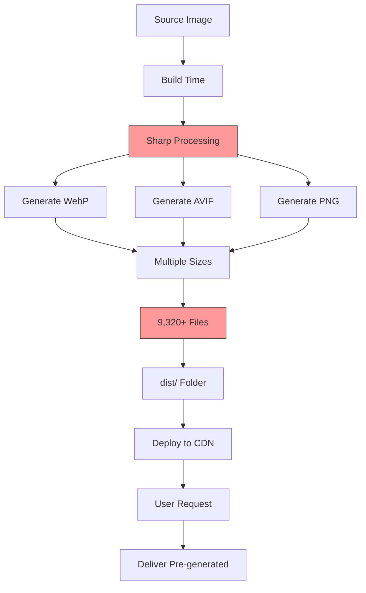
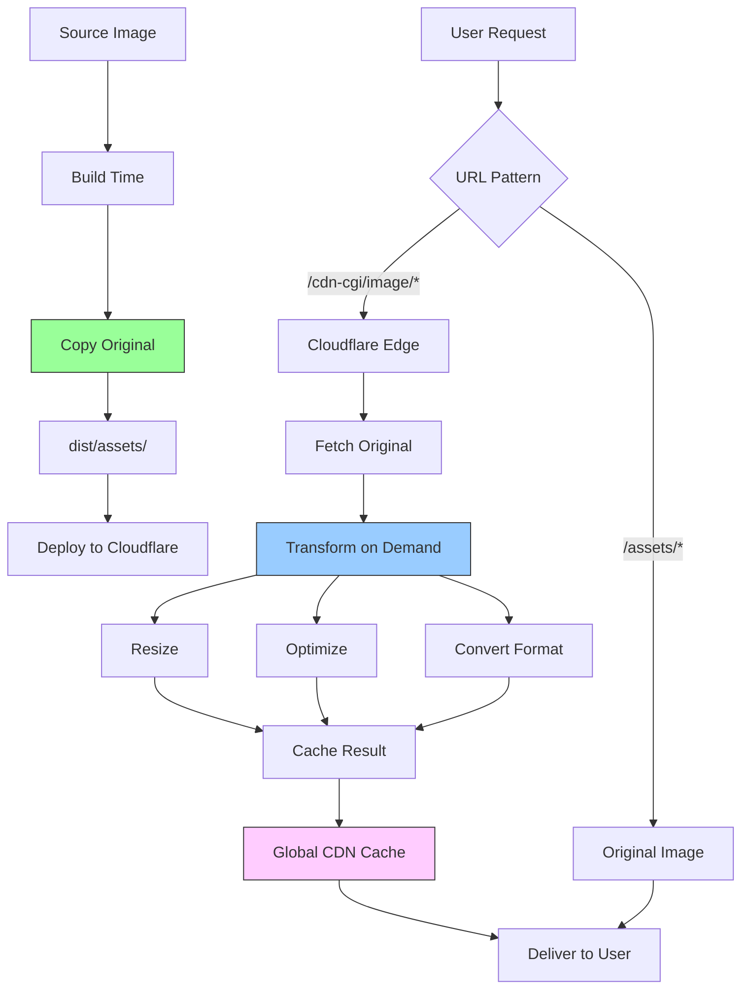
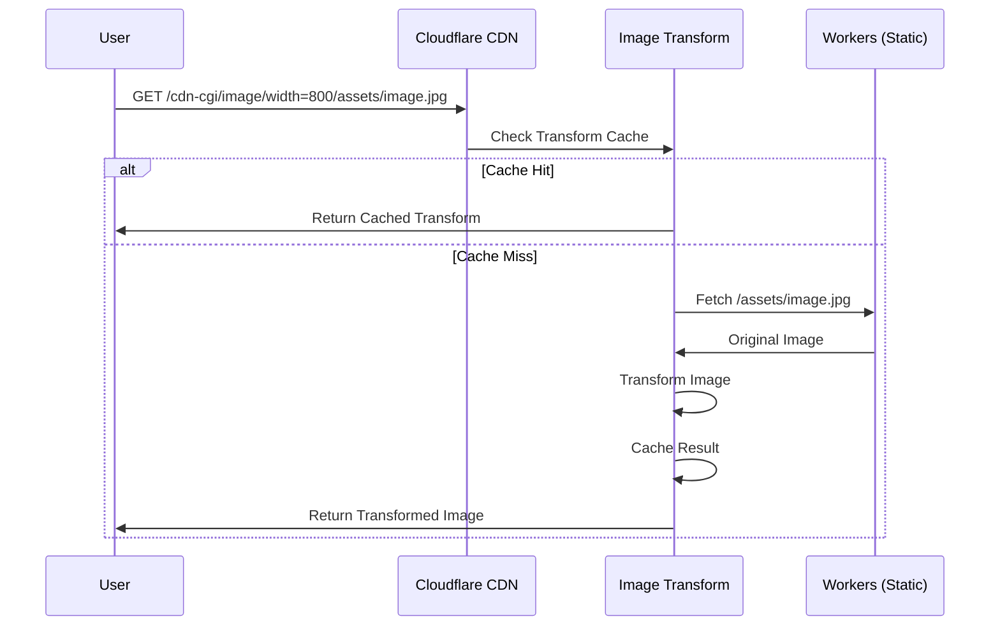
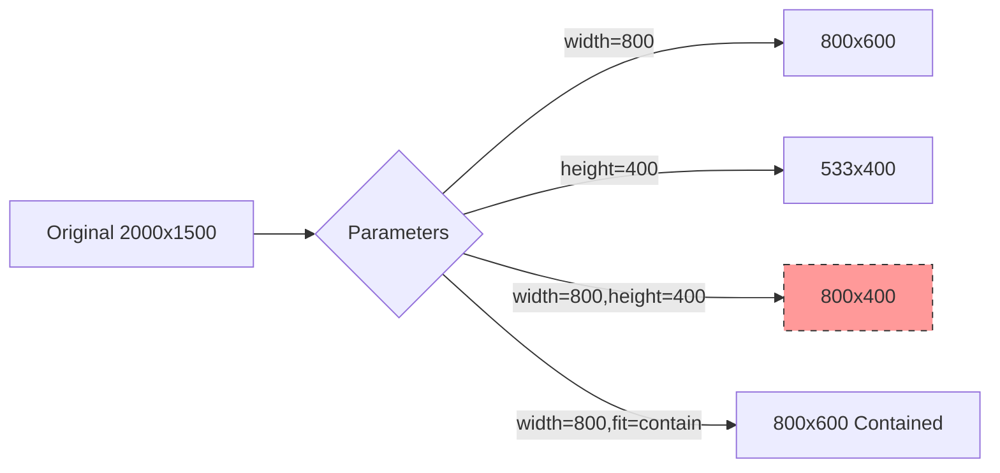
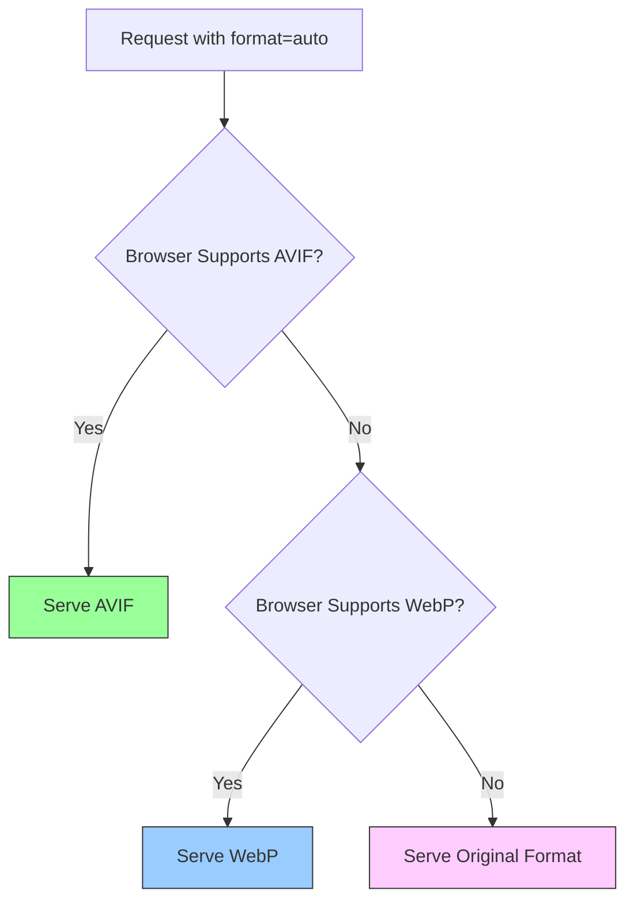
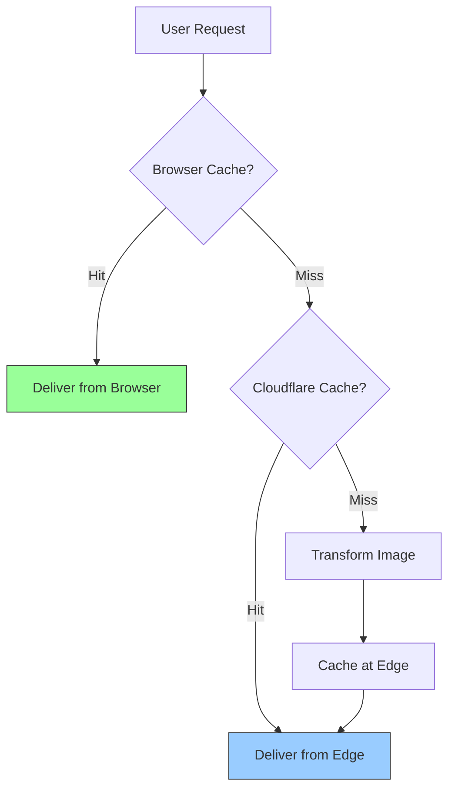

# Image Delivery Architecture

This document explains how images are processed and delivered in the Russ.Cloud blog using Cloudflare Image Transformations.

## Overview

The blog uses **Cloudflare Image Transformations** for on-demand image optimization and delivery. This approach eliminates build-time image processing, reduces build times from 20+ minutes to 2-3 minutes, and provides automatic format selection (AVIF/WebP) based on browser support.

## Architecture Comparison

### Traditional Approach (Not Used)



**Problems**:
- 20+ minute builds
- 9,320+ image operations per build
- Large `dist/` folder
- Heavy cache dependency
- Build timeouts on Cloudflare Pages

### Current Approach (Cloudflare Image Transformations)



**Benefits**:
- 2-3 minute builds (no processing)
- No image processing at build time
- Small `dist/` folder (original images only)
- On-demand optimization
- Global CDN caching

## How It Works

### Request Flow



### URL Structure

**Format**:
```
/cdn-cgi/image/{parameters}/{original-path}
```

**Example**:
```
/cdn-cgi/image/width=800,quality=85,format=auto/assets/2024-04-14/hero.jpg
```

**Parameters**:
- `width=800` - Resize to 800px width
- `quality=85` - Set quality to 85 (1-100)
- `format=auto` - Auto-select format (AVIF → WebP → original)

## Implementation

### Helper Utilities

**File**: `src/utils/cloudflare-images.ts`

```typescript
// Generate Cloudflare Image Resizing URL
export function getCFImageUrl(
  src: string | { src: string },
  options: CFImageOptions = {}
): string {
  const imagePath = typeof src === 'string' ? src : src.src;

  // Skip transformation for external URLs
  if (imagePath.startsWith('http://') || imagePath.startsWith('https://')) {
    return imagePath;
  }

  const params: string[] = [];
  if (options.width) params.push(`width=${options.width}`);
  if (options.quality) params.push(`quality=${options.quality}`);
  // ... more parameters

  // Defaults
  if (!options.format) params.push('format=auto');
  if (!options.quality) params.push('quality=85');

  return `/cdn-cgi/image/${params.join(',')}${imagePath}`;
}

// Generate responsive srcset
export function generateCFSrcSet(
  src: string | { src: string },
  widths: number[],
  quality: number = 85
): string {
  return widths
    .map(w => `${getCFImageUrl(src, { width: w, quality })} ${w}w`)
    .join(', ');
}
```

### Quality Presets

**File**: `src/utils/cloudflare-images.ts`

```typescript
export const CF_IMAGE_PRESETS = {
  // Hero images for blog posts
  hero: {
    quality: 85,
    format: 'auto' as const,
    fit: 'cover' as const,
    widths: [640, 1024, 1536, 2048]
  },

  // PostCard thumbnails
  thumbnail: {
    quality: 20,
    format: 'avif' as const,
    fit: 'cover' as const,
    widths: [320, 360, 480, 540, 600, 640, 720, 800, 960, 1080, 1200, 1600]
  },

  // PostCard thumbnails (priority/LCP)
  thumbnailPriority: {
    quality: 35,
    format: 'avif' as const,
    fit: 'cover' as const,
    widths: [320, 360, 480, 540, 600, 640, 720, 800, 960, 1080, 1200, 1600]
  },

  // Gallery/lightbox images (high quality)
  gallery: {
    quality: 90,
    format: 'auto' as const,
    fit: 'scale-down' as const,
    widths: [1024, 1536, 2048, 2560]
  },

  // Avatar images
  avatar: {
    quality: 85,
    format: 'auto' as const,
    fit: 'cover' as const,
    widths: [40, 48, 80, 96, 160, 192]
  }
};
```

### Component Usage

#### PostCard.astro (Blog Post Thumbnails)

```astro
---
import { getCFImageUrl, generateCFSrcSet, CF_IMAGE_PRESETS } from '../utils/cloudflare-images';

const preset = CF_IMAGE_PRESETS.thumbnail;
const heroSrcSet = generateCFSrcSet(heroImage, preset.widths, preset.quality);
---


```

#### BlogPost.astro (Hero Images)

```astro
---
const preset = CF_IMAGE_PRESETS.hero;
const heroSrcSet = generateCFSrcSet(displayImage, preset.widths, preset.quality);
---


```

#### Img.astro (Embed Component)

```astro
---
const isExternal = src.startsWith('http://') || src.startsWith('https://');

const imageSrcSet = !isExternal
  ? [640, 1024, 1536, 2048].map(w => `${getCFImageUrl(src, { width: w })} ${w}w`).join(', ')
  : '';
---


```

## Transformation Parameters

### Size Parameters



| Parameter | Description | Example |
|-----------|-------------|---------|
| `width` | Maximum width | `width=800` |
| `height` | Maximum height | `height=600` |
| `fit` | How to fit (scale-down/contain/cover/crop/pad) | `fit=cover` |
| `dpr` | Device pixel ratio (1-3) | `dpr=2` |

### Quality & Format

| Parameter | Description | Example | Default |
|-----------|-------------|---------|---------|
| `quality` | Image quality (1-100) | `quality=85` | 85 |
| `format` | Output format | `format=auto` | auto |

**Format Options**:
- `auto` - Browser-based selection (AVIF → WebP → original)
- `webp` - Force WebP
- `avif` - Force AVIF
- `jpeg` - Force JPEG
- `png` - Force PNG

### Advanced Parameters

| Parameter | Description | Example |
|-----------|-------------|---------|
| `gravity` | Crop focus (auto/left/right/top/bottom/center) | `gravity=auto` |
| `sharpen` | Sharpening (0-10) | `sharpen=1` |
| `blur` | Gaussian blur (0-250) | `blur=50` |
| `metadata` | Keep/strip metadata (keep/copyright/none) | `metadata=none` |
| `onerror` | Error handling | `onerror=redirect` |

## Format Selection

### Auto Format Logic



### Browser Support

| Format | Chrome | Firefox | Safari | Edge | File Size |
|--------|--------|---------|--------|------|-----------|
| **AVIF** | 85+ | 93+ | 16+ | 85+ | Smallest (~50% of JPEG) |
| **WebP** | 23+ | 65+ | 14+ | 18+ | Small (~75% of JPEG) |
| **JPEG** | All | All | All | All | Baseline |
| **PNG** | All | All | All | All | Lossless |

### Format Recommendations

| Use Case | Recommended Format | Quality | Why |
|----------|-------------------|---------|-----|
| Hero Images | `auto` | 85 | Balance quality/size, browser optimization |
| Thumbnails | `auto` | 80 | Smaller size, still good quality |
| Gallery (zoom) | `auto` | 90 | High quality for detailed viewing |
| Avatars | `auto` | 85 | Small files, good quality |
| Screenshots | `auto` | 90 | Preserve detail |
| Photos | `auto` | 85 | Natural compression |

## Caching Strategy

### Cache Hierarchy



### Cache Levels

1. **Browser Cache**:
   - Controlled by HTTP headers
   - Typically 7 days for images
   - Fastest delivery

2. **Cloudflare Edge Cache**:
   - 280+ global locations
   - Automatic cache management
   - ~90%+ hit rate after warmup

3. **Transform Cache**:
   - Separate cache for transformations
   - 30-day sliding window for billing
   - Unique URL = unique transformation

### Cache Headers

```http
cache-control: public, max-age=604800, immutable
cf-cache-status: HIT
cf-ray: 7a8b9c0d1e2f3g4h
content-type: image/webp
vary: Accept
```

## Performance Metrics

### Build Time Comparison

| Metric | Sharp (Old) | Cloudflare (Current) | Improvement |
|--------|-------------|----------------------|-------------|
| **First Build** | 20+ min | 2-3 min | **85% faster** |
| **Cached Build** | 2-5 min | 2-3 min | Consistent |
| **Image Processing** | 9,320 operations | 0 operations | **100% reduction** |
| **dist/ Size** | Large | Small | **90%+ smaller** |

### Runtime Performance

| Metric | Value |
|--------|-------|
| **First Request** | ~100-300ms (transform + cache) |
| **Cached Request** | ~10-50ms (edge delivery) |
| **Cache Hit Ratio** | >90% after warmup |
| **Global Latency** | <50ms from nearest edge |

### Free Tier Limits

| Resource | Free Tier | Current Usage | Headroom |
|----------|-----------|---------------|----------|
| **Unique Transformations** | 5,000/month | ~700/month | 86% available |
| **Requests** | 100,000/day | ~1,000/day | 99% available |
| **Bandwidth** | Unlimited (Workers) | ~10GB/month | Unlimited |

**Calculation Example**:
- 173 source images × 4 responsive widths = ~700 unique transformations
- Well within free tier

### Transformation Count

**What counts as unique**:
- Different URL = unique transformation
- `/cdn-cgi/image/width=800/image.jpg` ≠ `/cdn-cgi/image/width=1024/image.jpg`
- `format=auto` = 1 transformation (not 3)

**30-Day Sliding Window**:
- Transformations count for 30 days
- After 30 days, no longer count toward limit
- Effectively: monthly reset

## Monitoring & Debugging

### Cloudflare Dashboard

**Navigate to**: Cloudflare Dashboard → Images → Transformations

**Metrics Available**:
- Total transformations
- Unique transformations (billing metric)
- Cache hit ratio
- Bandwidth saved
- Error rate

### Browser DevTools

**Network Tab**:
```http
Request URL: /cdn-cgi/image/width=800,quality=85,format=auto/assets/image.jpg
Status: 200 OK
Content-Type: image/webp
CF-Cache-Status: HIT
CF-Ray: 7a8b9c0d1e2f3g4h
```

**Response Headers to Check**:
- `content-type` - Verify format (webp/avif/jpeg)
- `cf-cache-status` - HIT/MISS/DYNAMIC
- `cf-ray` - Unique request ID for debugging

### Testing Transformations

```bash
# Test transformation URL
curl -I "https://www.russ.cloud/cdn-cgi/image/width=800,quality=85,format=auto/assets/image.jpg"

# Check cache status
curl -I "https://www.russ.cloud/cdn-cgi/image/width=800/assets/image.jpg" | grep CF-Cache

# Test format selection
curl -H "Accept: image/avif" -I "https://www.russ.cloud/cdn-cgi/image/format=auto/assets/image.jpg"
```

### Common Issues

#### Images Not Transforming

**Symptom**: Original images served instead of transformed

**Possible Causes**:
1. Cloudflare Image Transformations not enabled for zone
2. URL pattern incorrect (must be `/cdn-cgi/image/...`)
3. External URL (transformations only work for same-origin)

**Solution**:
- Enable in Cloudflare dashboard: Images → Transformations
- Verify URL pattern: `/cdn-cgi/image/{params}/{path}`
- Check browser network tab for transformation URL

#### High Transformation Count

**Symptom**: Approaching free tier limit

**Possible Causes**:
1. Too many responsive sizes
2. URL parameters changing frequently
3. Cache not working properly

**Solution**:
- Reduce number of widths in srcset
- Use consistent URL parameters
- Check cache hit ratio in dashboard

#### Poor Image Quality

**Symptom**: Images look pixelated or compressed

**Possible Causes**:
1. Quality setting too low
2. Source image low resolution
3. Over-scaling (enlarging images)

**Solution**:
- Increase quality parameter (85-90)
- Use higher resolution source images
- Avoid enlarging beyond original size

## Migration from Sharp

### Before (Sharp Processing)

```astro
---
import { Image, Picture } from 'astro:assets';
---

<Picture
  src={heroImage}
  alt={alt}
  widths={[320, 640, 1024, 1536]}
  formats={['avif', 'webp']}
  quality={85}
/>
```

**Build time**: 20+ minutes

**Output**: 9,320+ processed images in `dist/_astro/`

### After (Cloudflare Transformations)

```astro
---
import { getCFImageUrl, generateCFSrcSet } from '../utils/cloudflare-images';
---


```

**Build time**: 2-3 minutes

**Output**: Original images only in `dist/assets/`

### Key Changes

1. **Remove Astro Image components**: Replace with standard `` tags
2. **Add helper functions**: Use `getCFImageUrl()` and `generateCFSrcSet()`
3. **Remove build config**: No Sharp or image service configuration
4. **Update GitHub Actions**: Remove build cache for processed images

## Best Practices

### 1. Use Quality Presets

```typescript
// Good: Use predefined presets
import { CF_IMAGE_PRESETS } from '../utils/cloudflare-images';
const preset = CF_IMAGE_PRESETS.hero;

// Avoid: Hardcoding quality values
const quality = 85; // Less maintainable
```

### 2. Limit Responsive Sizes

```typescript
// Good: 4-5 breakpoints is optimal
widths: [320, 640, 1024, 1536, 2048]

// Avoid: Too many sizes increases transformation count
widths: [200, 400, 600, 800, 1000, 1200, 1400, 1600, 1800, 2000]
```

### 3. Use format=auto

```typescript
// Good: Auto-select format
getCFImageUrl(src, { format: 'auto' })

// Avoid: Forcing specific formats (unless needed)
getCFImageUrl(src, { format: 'webp' })
```

### 4. Skip External URLs

```typescript
// Good: Check for external URLs
const isExternal = src.startsWith('http://') || src.startsWith('https://');
if (isExternal) return src;

// Avoid: Trying to transform external URLs (won't work)
getCFImageUrl('https://example.com/image.jpg')
```

### 5. Use Appropriate fit Values

```typescript
// Good: Preserve aspect ratio for photos
getCFImageUrl(src, { width: 800, fit: 'scale-down' })

// Good: Fill space for thumbnails
getCFImageUrl(src, { width: 400, height: 300, fit: 'cover' })

// Avoid: Stretching images
getCFImageUrl(src, { width: 800, height: 600 }) // May distort
```

## Troubleshooting Guide

### Problem: Images not loading

**Check**:
1. Network tab shows `/cdn-cgi/image/` URL
2. Response status is 200
3. Original image exists at specified path

**Solution**:
- Verify image path is correct
- Check Cloudflare dashboard for errors
- Test original image URL directly

### Problem: Low cache hit rate

**Check**:
- `CF-Cache-Status` header mostly shows MISS
- Transformation count increasing rapidly

**Solution**:
- Ensure URL parameters are consistent
- Check for dynamic parameters
- Review srcset sizes for duplicates

### Problem: Quality issues

**Check**:
- Quality parameter in URL
- Source image resolution
- Browser DevTools image details

**Solution**:
- Increase quality parameter (85-90)
- Use higher resolution source images
- Check original image quality

## Related Documentation

- [Architecture Overview](./overview.md)
- [Build & Deployment](./build-deployment.md)
- [Component Reference](../reference/embed-components.md)
- [Cloudflare Image Transformations Docs](https://developers.cloudflare.com/images/transform-images/)

---

**Last Updated**: November 2025
