# Architecture Overview

This document provides a high-level overview of the Russ.Cloud blog architecture, including the tech stack, data flow, and key design decisions.

## System Architecture

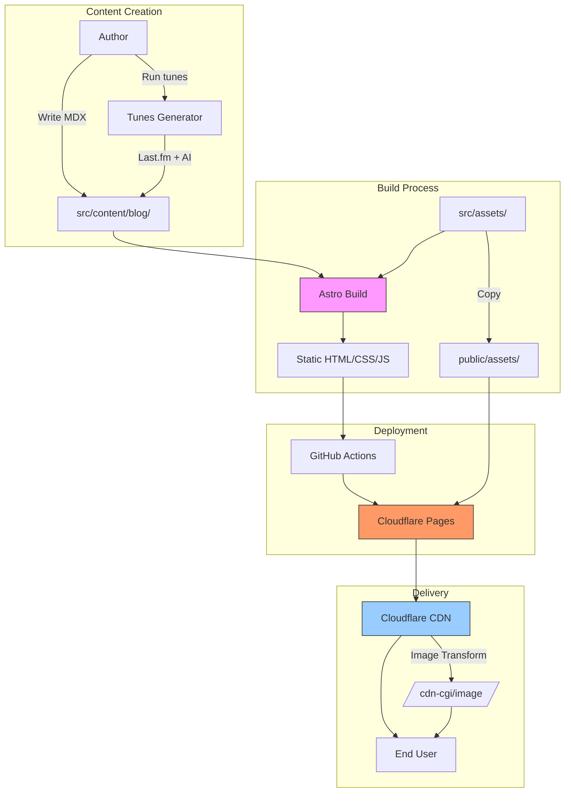

## Technology Stack

### Core Framework

| Component | Technology | Purpose |
|-----------|-----------|---------|
| **Framework** | Astro 5.x | Static site generation with islands architecture |
| **Language** | TypeScript | Type-safe development |
| **Styling** | Tailwind CSS 4.x | Utility-first CSS framework |
| **Content** | MDX | Markdown with JSX components |

### Infrastructure

| Component | Technology | Purpose |
|-----------|-----------|---------|
| **Hosting** | Cloudflare Workers (static) | Edge deployment |
| **CDN** | Cloudflare CDN | Global content delivery |
| **Images** | Cloudflare Image Transformations | On-demand image optimization |
| **DNS** | Cloudflare | Domain management |
| **CI/CD** | GitHub Actions | Automated builds and deployment |

### Content & Features

| Component | Technology | Purpose |
|-----------|-----------|---------|
| **Content Collections** | Astro Content Collections | Type-safe content management |
| **Search** | Pagefind | Static search index |
| **Analytics** | Plausible | Privacy-focused analytics |
| **Syntax Highlighting** | Expressive Code | Code block styling |
| **Image Gallery** | LightGallery | Lightbox image viewer |
| **OpenGraph Images** | astro-og-canvas | Auto-generated OG images |

## Data Flow

### Blog Post Rendering

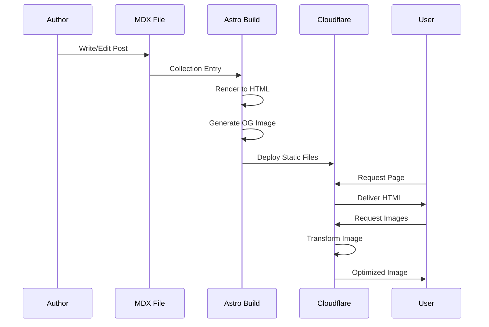

### Tunes Generation Flow

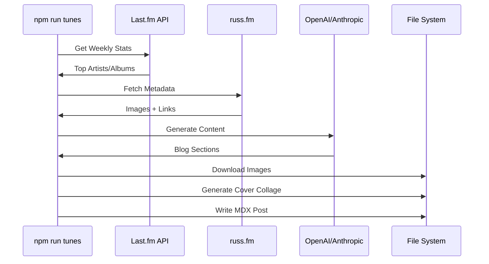

## URL Structure

### Blog Posts

```
https://www.russ.cloud/YYYY/MM/DD/slug/
```

Example: `https://www.russ.cloud/2024/04/14/installing-invokeai-on-macos/`

**Routing**: Dynamic route at `src/pages/[year]/[month]/[day]/[slug].astro`

### Content Collections

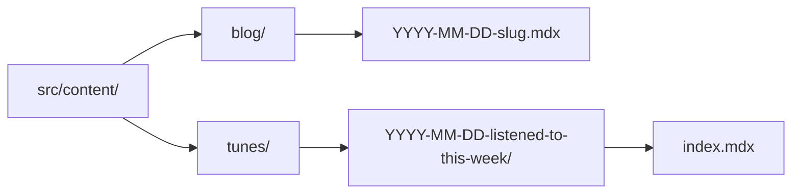

### Static Assets

| Type | Location | Delivery |
|------|----------|----------|
| **Source Images** | `src/assets/YYYY-MM-DD-slug/` | Via Cloudflare Image Transformations |
| **Public Assets** | `public/assets/` | Direct CDN delivery |
| **Avatars** | `public/images/avatars/` | Direct CDN delivery |
| **Cover Images** | `src/assets/YYYY-MM-DD-slug/cover.jpg` | Via Cloudflare Image Transformations |

## Content Types

### Blog Posts

**Location**: `src/content/blog/`

**Schema**: Defined in `src/content.config.ts`

**Key Features**:
- MDX support with global components
- Frontmatter validation via Zod
- Auto-generated OpenGraph images
- SEO meta tags and structured data
- Dark mode support
- Table of contents (optional)

### Tunes Posts

**Location**: `src/content/tunes/`

**Schema**: Extended blog schema with music metadata

**Key Features**:
- AI-generated content
- Album/artist galleries
- Last.fm integration
- Auto-generated cover collages
- Listening statistics

## Component Architecture

### Layout Hierarchy

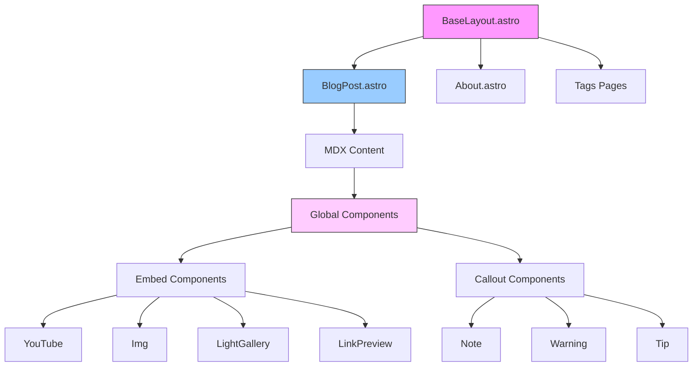

### Component Types

**Layout Components** (`src/components/layout/`):
- `BaseHead.astro` - SEO, meta tags, schema
- `Header.astro` - Navigation and theme switcher
- `Footer.astro` - Footer with social links
- `Breadcrumbs.astro` - Breadcrumb navigation

**Blog Components** (`src/components/blog/`):
- `PostCard.astro` - Blog post preview cards
- `RelatedPosts.astro` - Tag-based related posts
- `TableOfContents.astro` - Auto-generated ToC
- `ReadingTime.astro` - Reading time estimate

**Embed Components** (`src/components/embeds/`):
- Media: YouTube, Instagram, Giphy, Audio, AppleMusic
- Content: LinkPreview, ChatMessage, Img, LightGallery
- Callouts: Note, Tip, Warning, Important, Caution, Info

## Build Process

### Local Development

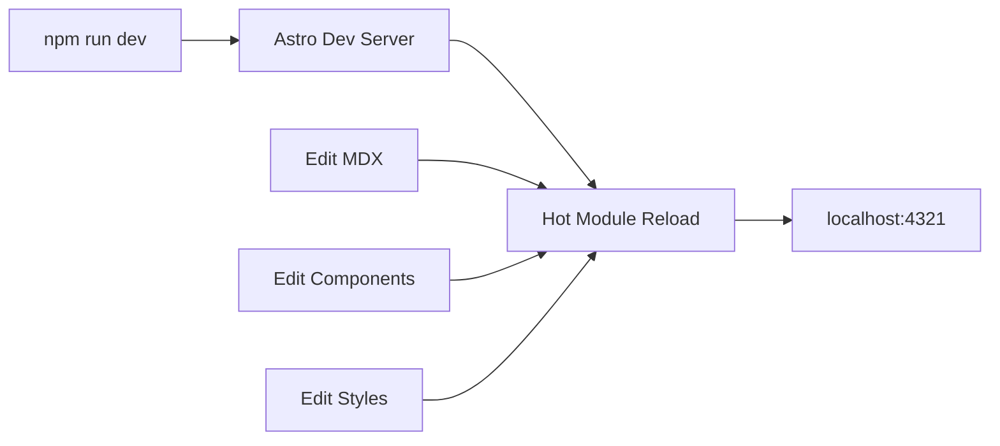

**Key Points**:
- No image processing in dev (Cloudflare transforms don't work locally)
- Fast hot reloading
- TypeScript type checking
- Real-time content updates

### Production Build

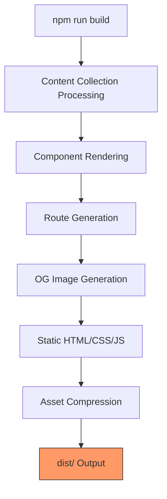

**Build Time**: ~2-3 minutes

**Output**: Fully static site in `dist/`

### Deployment Pipeline

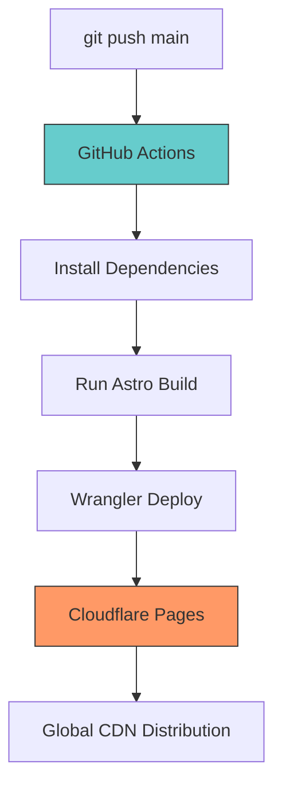

**Workflow**: `.github/workflows/deploy.yml`

**Triggers**:
- Push to `main` branch
- Pull request builds (preview)

**Deployment Time**: ~3-5 minutes total

## Image Processing Architecture

### Traditional Approach (Not Used)


**Issues**: 20+ minute builds, large dist folder, cache dependency

### Current Approach (Cloudflare Image Transformations)

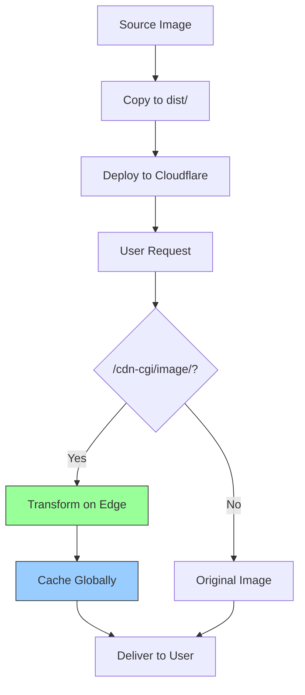

**Benefits**:
- 2-3 minute builds (no processing)
- On-demand optimization
- Global CDN caching
- Automatic format selection (AVIF/WebP)

See [image-delivery.md](./image-delivery.md) for details.

## SEO Architecture

### Meta Tags & Social Sharing

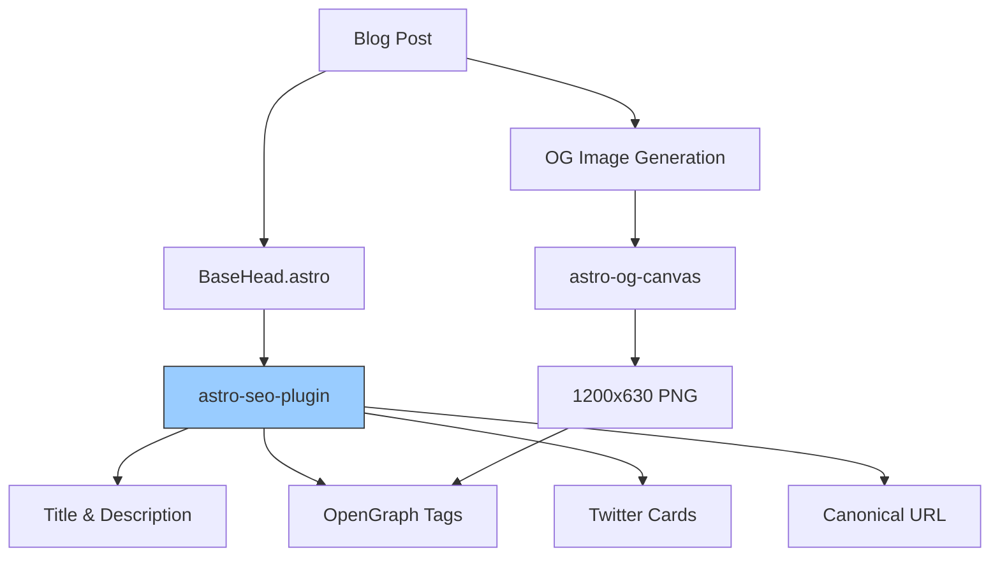

### Structured Data

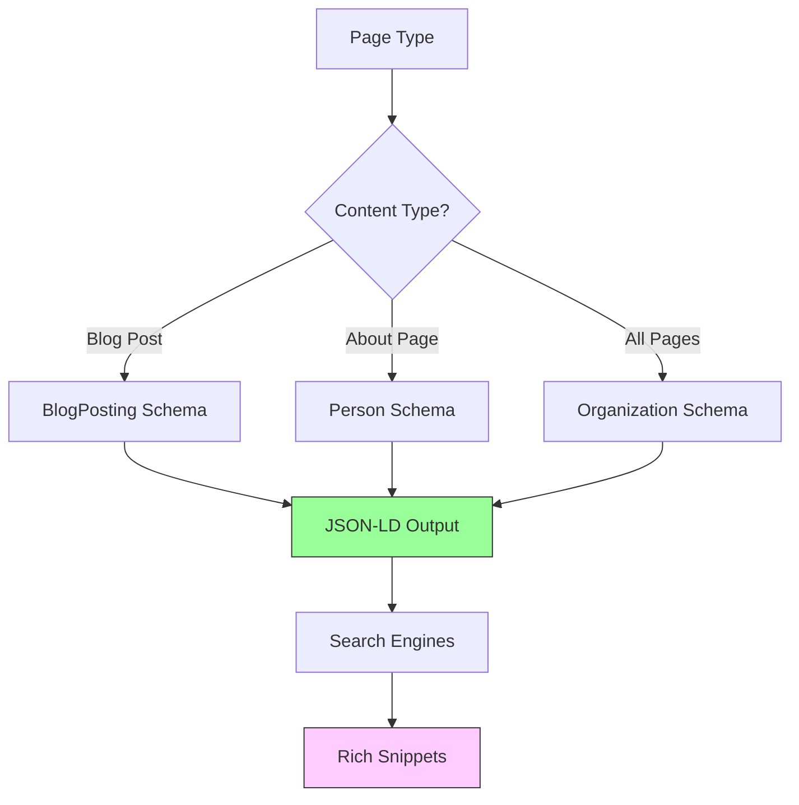

**Schema Types Implemented**:
- BlogPosting (all blog posts)
- Person (author information)
- Organization (publisher)
- BreadcrumbList (navigation)

See [seo-implementation.md](./seo-implementation.md) for details.

## Performance Characteristics

### Build Performance

| Metric | Value |
|--------|-------|
| **Build Time** | 2-3 minutes |
| **Source Images** | 173 images |
| **Output Size** | Small (no processed images) |
| **Node Modules** | ~500MB (cached) |

### Runtime Performance

| Metric | Target | Actual |
|--------|--------|--------|
| **Lighthouse Score** | 90+ | 95+ |
| **First Contentful Paint** | <1.8s | <1.5s |
| **Largest Contentful Paint** | <2.5s | <2.0s |
| **Time to Interactive** | <3.8s | <3.0s |

### CDN Performance

| Metric | Value |
|--------|-------|
| **Edge Locations** | 280+ worldwide |
| **Cache Hit Ratio** | >90% |
| **Image Transform Free Tier** | 5,000/month |
| **Current Usage** | ~700/month |

## Security & Privacy

### Content Security

- Static HTML (no server-side code)
- No database or user authentication
- Read-only deployment (no write access)

### Privacy

- Plausible Analytics (no cookies, GDPR compliant)
- No third-party tracking
- External links: `nofollow noopener noreferrer`

### Image Security

- Images served from trusted origin (own domain)
- Cloudflare Image Transformations (validated)
- No external image hotlinking

## Monitoring & Analytics

### Build Monitoring

- GitHub Actions logs
- Build time tracking
- Deployment status

### Site Analytics

- Plausible Analytics dashboard
- Page views and traffic sources
- No personal data collection

### Performance Monitoring

- Cloudflare Analytics
- Image transformation usage
- Cache hit rates
- Bandwidth usage

## Key Design Decisions

### Why Astro?

- **Islands Architecture**: Minimal JavaScript, maximum performance
- **Content Collections**: Type-safe content management
- **MDX Support**: Rich component-based content
- **Static Output**: Perfect for Cloudflare Pages

### Why Cloudflare?

- **Global CDN**: 280+ edge locations
- **Image Transformations**: On-demand optimization
- **Free Tier**: Generous limits for personal blogs
- **Worker Compatibility**: Future SSR option if needed

### Why Static?

- **Performance**: Sub-second page loads
- **Security**: No attack surface
- **Cost**: Free hosting
- **Reliability**: No server crashes

### Why MDX?

- **Component Reuse**: Embed components in markdown
- **Type Safety**: Props validated at build time
- **Flexibility**: Mix markdown and JSX
- **Migration**: Easy migration from Hugo

## Future Considerations

### Potential Enhancements

1. **Incremental Builds**: Astro experimental feature
2. **Edge SSR**: For dynamic content (comments, etc.)
3. **Service Worker**: Offline support
4. **Image Preloading**: Predictive image loading

### Scalability

**Current Capacity**:
- Unlimited static pages
- 5,000 image transformations/month (free)
- 100K Cloudflare Workers requests/day (free)

**Growth Path**:
- Paid Cloudflare plan if needed
- CDN already global scale
- No database scaling concerns

## Related Documentation

- [Image Delivery Architecture](./image-delivery.md)
- [SEO Implementation](./seo-implementation.md)
- [Build & Deployment](./build-deployment.md)
- [Component Reference](../reference/embed-components.md)

---

**Last Updated**: November 2025
