# Architecture Overview

This document provides a high-level overview of the Russ.Cloud blog architecture, including the tech stack, data flow, and key design decisions.

## System Architecture

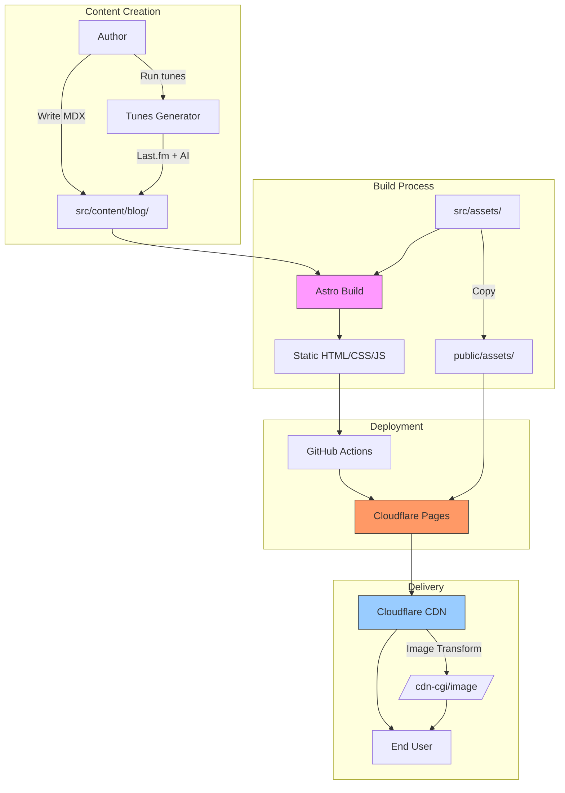
```mermaid
graph TB
    subgraph "Content Creation"
        A[Author] -->|Write MDX| B[src/content/blog/]
        A -->|Run tunes| C[Tunes Generator]
        C -->|Last.fm + AI| B
    end

    subgraph "Build Process"
        B --> D[Astro Build]
        E[src/assets/] --> D
        D --> F[Static HTML/CSS/JS]
        E -->|Copy| G[public/assets/]
    end

    subgraph "Deployment"
        F --> H[GitHub Actions]
        H --> I[Cloudflare Pages]
        G --> I
    end

    subgraph "Delivery"
        I --> J[Cloudflare CDN]
        J -->|Image Transform| K[/cdn-cgi/image/]
        J --> L[End User]
        K --> L
    end

    style D fill:#f9f,stroke:#333
    style I fill:#f96,stroke:#333
    style J fill:#9cf,stroke:#333
```

## Technology Stack

### Core Framework

| Component | Technology | Purpose |
|-----------|-----------|---------|
| **Framework** | Astro 5.x | Static site generation with islands architecture |
| **Language** | TypeScript | Type-safe development |
| **Styling** | Tailwind CSS 4.x | Utility-first CSS framework |
| **Content** | MDX | Markdown with JSX components |

### Infrastructure

| Component | Technology | Purpose |
|-----------|-----------|---------|
| **Hosting** | Cloudflare Workers (static) | Edge deployment |
| **CDN** | Cloudflare CDN | Global content delivery |
| **Images** | Cloudflare Image Transformations | On-demand image optimization |
| **DNS** | Cloudflare | Domain management |
| **CI/CD** | GitHub Actions | Automated builds and deployment |

### Content & Features

| Component | Technology | Purpose |
|-----------|-----------|---------|
| **Content Collections** | Astro Content Collections | Type-safe content management |
| **Search** | Pagefind | Static search index |
| **Analytics** | Plausible | Privacy-focused analytics |
| **Syntax Highlighting** | Expressive Code | Code block styling |
| **Image Gallery** | LightGallery | Lightbox image viewer |
| **OpenGraph Images** | astro-og-canvas | Auto-generated OG images |

## Data Flow

### Blog Post Rendering

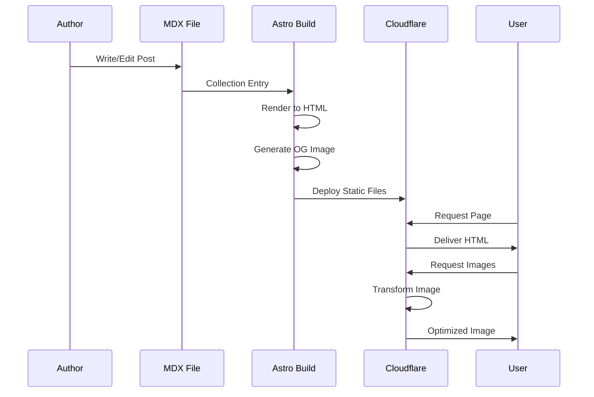
```mermaid
sequenceDiagram
    participant Author
    participant MDX as MDX File
    participant Astro as Astro Build
    participant CF as Cloudflare
    participant User

    Author->>MDX: Write/Edit Post
    MDX->>Astro: Collection Entry
    Astro->>Astro: Render to HTML
    Astro->>Astro: Generate OG Image
    Astro->>CF: Deploy Static Files
    User->>CF: Request Page
    CF->>User: Deliver HTML
    User->>CF: Request Images
    CF->>CF: Transform Image
    CF->>User: Optimized Image
```

### Tunes Generation Flow

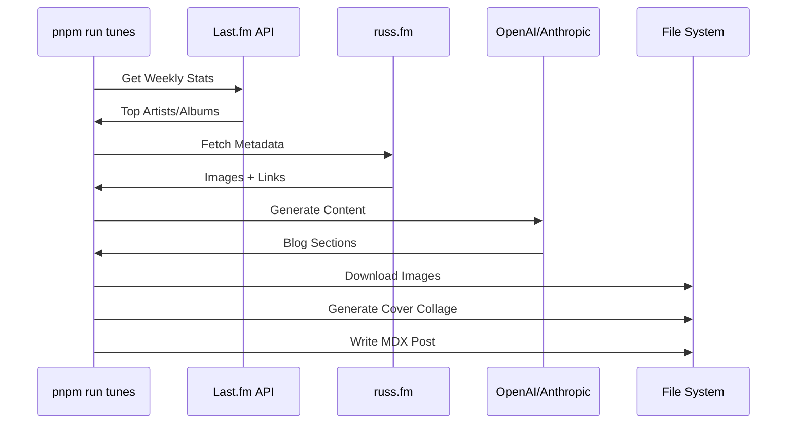
```mermaid
sequenceDiagram
    participant CLI as pnpm run tunes
    participant LastFM as Last.fm API
    participant Collection as russ.fm
    participant AI as OpenAI/Anthropic
    participant Files as File System

    CLI->>LastFM: Get Weekly Stats
    LastFM->>CLI: Top Artists/Albums
    CLI->>Collection: Fetch Metadata
    Collection->>CLI: Images + Links
    CLI->>AI: Generate Content
    AI->>CLI: Blog Sections
    CLI->>Files: Download Images
    CLI->>Files: Generate Cover Collage
    CLI->>Files: Write MDX Post
```

## URL Structure

### Blog Posts

```
https://www.russ.cloud/YYYY/MM/DD/slug/
```

Example: `https://www.russ.cloud/2024/04/14/installing-invokeai-on-macos/`

**Routing**: Dynamic route at `src/pages/[year]/[month]/[day]/[slug].astro`

### Content Collections

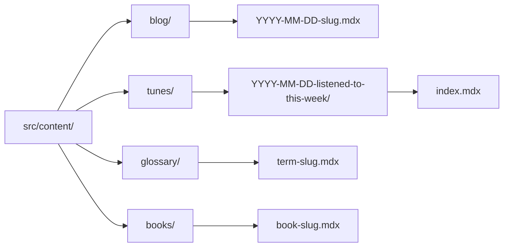
```mermaid
graph LR
    A[src/content/] --> B[blog/]
    A --> C[tunes/]
    A --> G[glossary/]
    A --> K[books/]
    B --> D[YYYY-MM-DD-slug.mdx]
    C --> E[YYYY-MM-DD-listened-to-this-week/]
    E --> F[index.mdx]
    G --> H[term-slug.mdx]
    K --> L[book-slug.mdx]
```

### Programmatic SEO Routes

The site builds several taxonomy and browse hubs from the content collections and a build-time data file:

| Route | Purpose | Source |
|-------|---------|--------|
| `/tags/{tag}/[page]/` | Posts filtered by tag, with related-tag links and tag-specific OG image | `blog` collection + `TAG_METADATA` |
| `/tags/{tag}-og.png` | Per-tag OpenGraph image | Generated from tag title + description |
| `/tags/{tag}/rss.xml` | Per-tag RSS feed | `blog` collection |
| `/tunes/artist/` and `/tunes/artist/{slug}/[page]/` | Browse weekly posts by featured artist, with local artist images on the index page | `src/data/tunes-index.json` |
| `/tunes/album/` and `/tunes/album/{slug}/` | Browse by featured album, with local album images and `MusicRecording` schema | `src/data/tunes-index.json` |
| `/tunes/rss.xml` | Tunes-only RSS feed | `tunes` collection |
| `/glossary/` and `/glossary/{term}/` | Technical terminology across cloud, AI, automation, code, security, and tools with `DefinedTerm` schema | `glossary` collection |
| `/books/` and `/books/{slug}/` | Bookshelf index and per-book detail pages with `Book` schema, related blog posts via tag overlap, and per-book OG images | `books` collection |
| `/author/russ-mckendrick/` | Person hub with recent posts and top tags | `blog` collection + `consts.ts` |

`src/data/tunes-index.json` is regenerated by `scripts/build-tunes-index.js` (wired into `pnpm run prebuild` and the end of `pnpm run tunes`). It parses the "Top Albums" section out of every weekly tunes post into a sorted artist/album lookup, merges duplicate album variants, and records matching `public/assets/` image paths for the browse cards.

### Static Assets

| Type | Location | Delivery |
|------|----------|----------|
| **Source Images** | `src/assets/YYYY-MM-DD-slug/` | Via Cloudflare Image Transformations |
| **Public Assets** | `public/assets/` | Direct CDN delivery |
| **Avatars** | `public/images/avatars/` | Direct CDN delivery |
| **Cover Images** | `src/assets/YYYY-MM-DD-slug/cover.jpg` | Via Cloudflare Image Transformations |
| **LinkPreview Images** | `public/assets/link-previews/` | Via Cloudflare Image Transformations |

## Content Types

### Blog Posts

**Location**: `src/content/blog/`

**Schema**: Defined in `src/content.config.ts`

**Key Features**:
- MDX support with global components
- Frontmatter validation via Zod
- Auto-generated OpenGraph images
- SEO meta tags and structured data
- Dark mode support
- Table of contents (optional)

### Tunes Posts

**Location**: `src/content/tunes/`

**Schema**: Extended blog schema with music metadata. Uses flat `heroImage` only - `cover` is no longer accepted on tunes (blog posts still use `cover` for richer caption/alt support).

**Key Features**:
- AI-generated content
- Album/artist galleries
- Last.fm integration
- Auto-generated cover collages
- Listening statistics

### Books

**Location**: `src/content/books/`

**Schema**: Defined in `src/content.config.ts` (`books` collection)

**Key Features**:
- One MDX file per book; the file's id (filename without extension) becomes the URL slug at `/books/{slug}/`
- `/books/` index renders a 4-column cover grid linking into the per-book pages, ordered by the explicit `order` field
- Per-book detail page emits `Book` and `BreadcrumbList` JSON-LD, surfaces metadata (year, publisher, topic), and lists up to 6 related blog posts via tag-overlap (normalised through `normalizeTagSlug`)
- Per-book OG image at `/books/{slug}-og.png` reusing the same generator pattern as glossary/blog OG images
- Out-of-print titles omit `buyLink` and render "No longer in print." in place of the buy button

## Component Architecture

### Layout Hierarchy

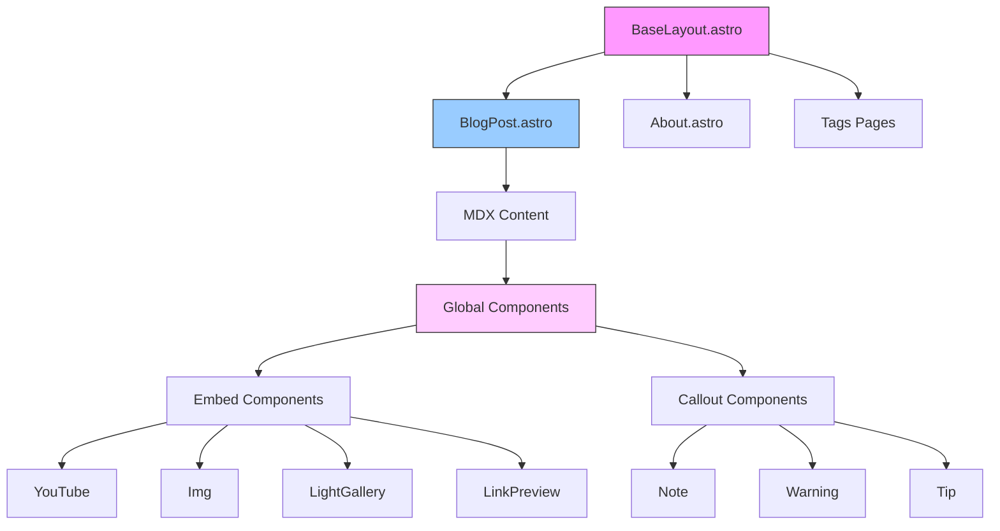
```mermaid
graph TD
    A[BaseLayout.astro] --> B[BlogPost.astro]
    A --> C[About.astro]
    A --> D[Tags Pages]

    B --> E[MDX Content]
    E --> F[Global Components]

    F --> G[Embed Components]
    F --> H[Callout Components]

    G --> I[YouTube]
    G --> J[Img]
    G --> K[LightGallery]
    G --> L[LinkPreview]

    H --> M[Note]
    H --> N[Warning]
    H --> O[Tip]

    style A fill:#f9f,stroke:#333
    style B fill:#9cf,stroke:#333
    style F fill:#fcf,stroke:#333
```

### Component Types

**Layout Components** (`src/components/layout/`):
- `BaseHead.astro` - SEO, meta tags, schema
- `Header.astro` - Navigation and theme switcher
- `Footer.astro` - Footer navigation and site metadata
- `Breadcrumbs.astro` - Breadcrumb navigation

**Blog Components** (`src/components/blog/`):
- `PostCard.astro` - Rule-separated post index entries (featured/vertical/grid/horizontal variants)
- `RelatedPosts.astro` - Tag-based related posts
- `TableOfContents.astro` - Inline collapsible ToC
- `StickyTableOfContents.astro` - Sticky sidebar ToC with scroll-aware active highlighting (2xl+)
- `ReadingTime.astro` - Reading time estimate

**Reading Components** (`src/components/reading/`):
- `ReadingHeader.astro` - Page title, article count, and tag filter buttons
- `ReadingList.astro` - Hairline-framed grid grouped by month; each entry shows OG image, title, cached description (from `reading-image-cache.json`), domain favicon, date, and tags

**Embed Components** (`src/components/embeds/`):
- Media: YouTube, Instagram, Giphy, Audio, AppleMusic
- Content: LinkPreview, ChatMessage, Img, LightGallery
- Callouts: Note, Tip, Warning, Important, Caution, Info

## Build Process

### Local Development

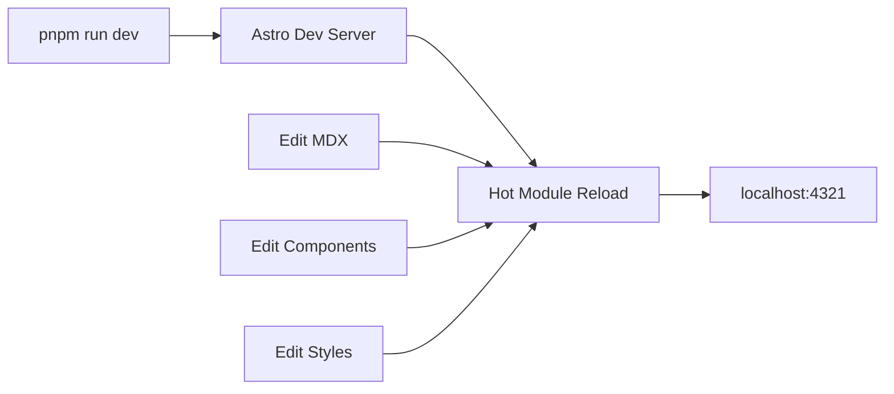
```mermaid
graph LR
    A[pnpm run dev] --> B[Astro Dev Server]
    B --> C[Hot Module Reload]
    C --> D[localhost:4321]

    E[Edit MDX] --> C
    F[Edit Components] --> C
    G[Edit Styles] --> C
```

**Key Points**:
- No image processing in dev (Cloudflare transforms don't work locally)
- Fast hot reloading
- TypeScript type checking
- Real-time content updates

### Production Build

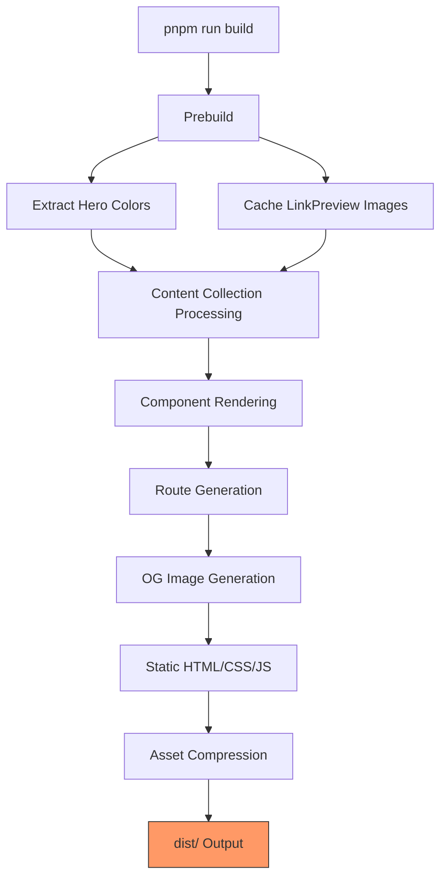
```mermaid
graph TD
    A[pnpm run build] --> B[Prebuild]
    B --> B1[Extract Hero Colors]
    B --> B2[Cache LinkPreview Images]
    B1 --> C[Content Collection Processing]
    B2 --> C
    C --> D[Component Rendering]
    D --> E[Route Generation]
    E --> F[OG Image Generation]
    F --> G[Static HTML/CSS/JS]
    G --> H[Asset Compression]
    H --> I[dist/ Output]

    style I fill:#f96,stroke:#333
```

**Build Time**: ~2-3 minutes

**Output**: Fully static site in `dist/`

### Deployment Pipeline

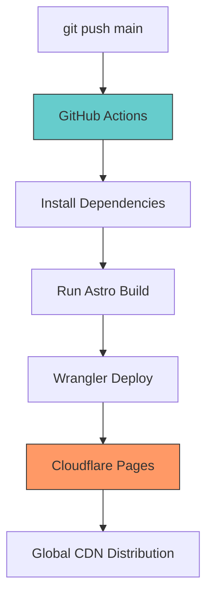
```mermaid
graph TD
    A[git push main] --> B[GitHub Actions]
    B --> C[Install Dependencies]
    C --> D[Run Astro Build]
    D --> E[Wrangler Deploy]
    E --> F[Cloudflare Pages]
    F --> G[Global CDN Distribution]

    style B fill:#6cc,stroke:#333
    style F fill:#f96,stroke:#333
```

**Workflows**:
- `.github/workflows/deploy.yml` - Main deployment
- `.github/workflows/refresh-link-previews.yml` - Weekly OG image refresh

**Triggers**:
- Push to `main` branch
- Pull request builds (preview)
- Weekly schedule (Sundays) for link preview refresh

**Deployment Time**: ~3-5 minutes total

## Image Processing Architecture

### Traditional Approach (Not Used)

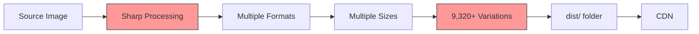
```mermaid
graph LR
    A[Source Image] --> B[Sharp Processing]
    B --> C[Multiple Formats]
    C --> D[Multiple Sizes]
    D --> E[9,320+ Variations]
    E --> F[dist/ folder]
    F --> G[CDN]

    style B fill:#f99,stroke:#333
    style E fill:#f99,stroke:#333
```

**Issues**: 20+ minute builds, large dist folder, cache dependency

### Current Approach (Cloudflare Image Transformations)

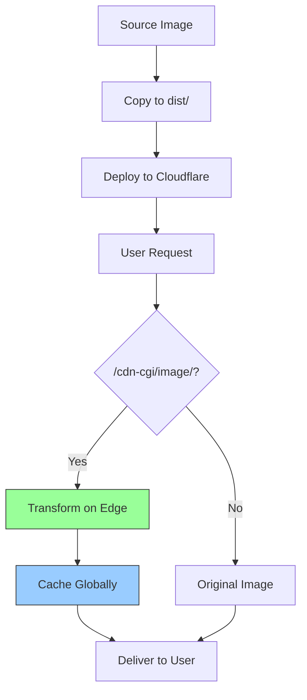
```mermaid
graph TD
    A[Source Image] --> B[Copy to dist/]
    B --> C[Deploy to Cloudflare]
    C --> D[User Request]
    D --> E{/cdn-cgi/image/?}
    E -->|Yes| F[Transform on Edge]
    E -->|No| G[Original Image]
    F --> H[Cache Globally]
    H --> I[Deliver to User]
    G --> I

    style F fill:#9f9,stroke:#333
    style H fill:#9cf,stroke:#333
```

**Benefits**:
- 2-3 minute builds (no processing)
- On-demand optimization
- Global CDN caching
- Automatic format selection (AVIF/WebP)

See [image-delivery.md](./image-delivery.md) for details.

## SEO Architecture

### Meta Tags & Social Sharing

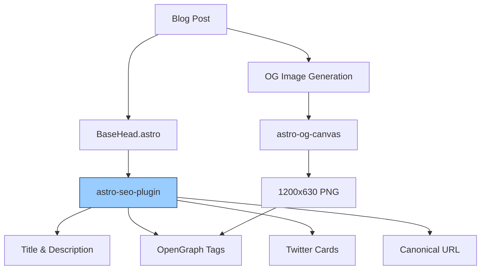
```mermaid
graph TD
    A[Blog Post] --> B[BaseHead.astro]
    B --> C[astro-seo-plugin]
    C --> D[Title & Description]
    C --> E[OpenGraph Tags]
    C --> F[Twitter Cards]
    C --> G[Canonical URL]

    A --> H[OG Image Generation]
    H --> I[astro-og-canvas]
    I --> J[1200x630 PNG]
    J --> E

    style C fill:#9cf,stroke:#333
```

### Structured Data

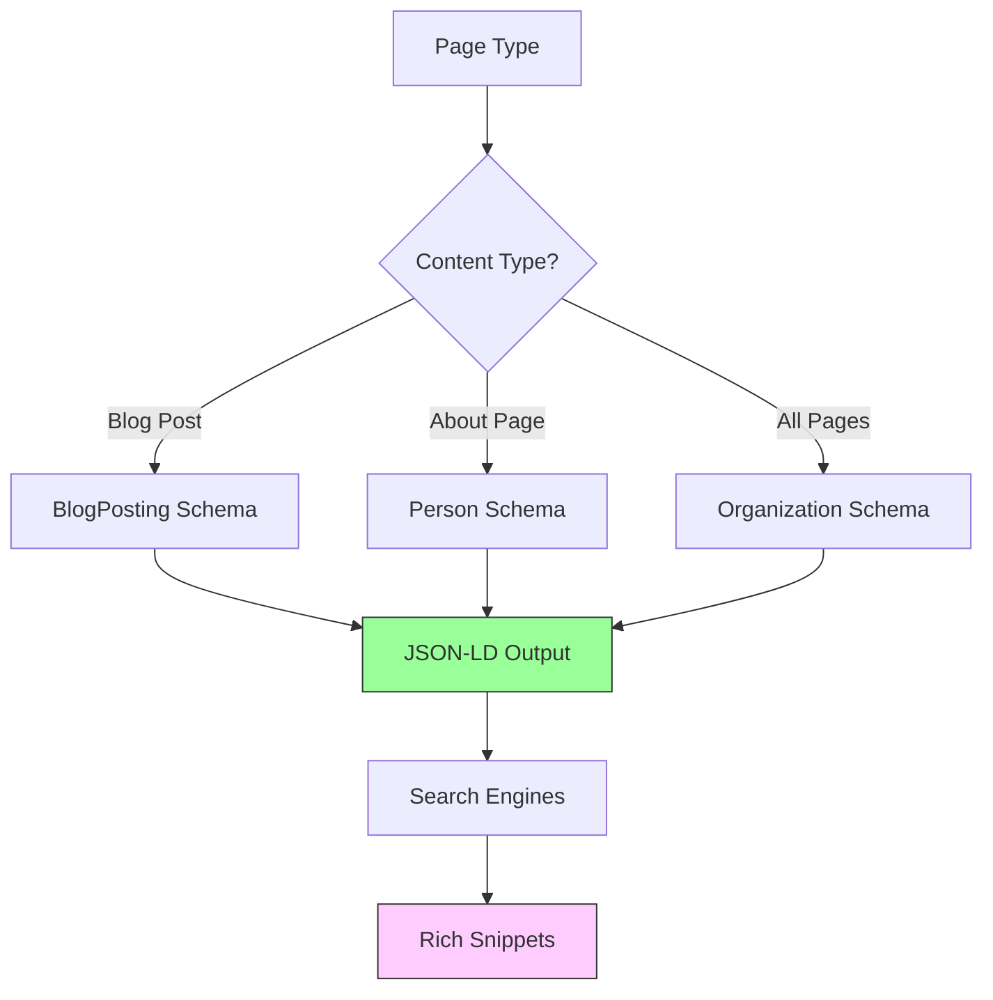
```mermaid
graph TD
    A[Page Type] --> B{Content Type?}
    B -->|Blog Post| C[BlogPosting Schema]
    B -->|About Page| D[Person Schema]
    B -->|All Pages| E[Organization Schema]

    C --> F[JSON-LD Output]
    D --> F
    E --> F

    F --> G[Search Engines]
    G --> H[Rich Snippets]

    style F fill:#9f9,stroke:#333
    style H fill:#fcf,stroke:#333
```

**Schema Types Implemented**:
- BlogPosting (all blog posts)
- Person (author information)
- Organization (publisher)
- BreadcrumbList (navigation)

See [seo-implementation.md](./seo-implementation.md) for details.

## Agent Discovery

The site exposes machine-readable discovery signals for AI agents and crawlers, per emerging RFCs from `isitagentready.com` / `contentsignals.org`.

### Static files

| Path | Purpose |
|------|---------|
| `public/robots.txt` | Classic crawl policy plus `Content-Signal: search=yes, ai-input=yes, ai-train=yes` (contentsignals.org). Static - edit by hand; the `astro-robots-txt` integration was removed. |
| `public/.well-known/agent-skills/index.json` | Agent Skills Discovery RFC v0.2.0 index listing available SKILL.md artefacts with `sha256` digests. |
| `public/.well-known/agent-skills/read-blog-content/SKILL.md` | Skill describing feeds, sitemap, and URL patterns for consuming the blog. |
| `dist/llms.txt` (generated) | llmstxt.org index - lists every post with its markdown URL. Written by `scripts/generate-llms-markdown.js` after `astro build`. |
| `dist/YYYY/MM/DD/<slug>/index.md` (generated) | Plain-markdown twin of each HTML post, same path with `.md` basename. Same script. |

### Response headers

`public/_headers` attaches `Link:` headers (RFC 8288) to `/` and `/*.html` pointing to the sitemap index, RSS feed, and agent-skills index so agents can discover resources without parsing HTML.

### Updating SKILL.md

After editing any `SKILL.md` file, regenerate its digest and update `index.json`:

```bash
shasum -a 256 public/.well-known/agent-skills/read-blog-content/SKILL.md
```

Paste the hex output into the `digest` field as `sha256:<hex>`.

### Markdown delivery (Free-plan approach)

Cloudflare's zone-level "Markdown for Agents" (Dashboard → AI Crawl Control) requires Pro+. This site is on Free, so equivalent behaviour is built in two layers:

1. **Build-time twin.** `scripts/generate-llms-markdown.js` runs after `astro build` (wired into the `build` npm script). It walks `src/content/blog/` and `src/content/tunes/`, parses frontmatter with `gray-matter`, and writes an `index.md` alongside each post at the same URL path. It also writes `/llms.txt` at the site root.
2. **Runtime content negotiation.** `worker/index.js` is a minimal Cloudflare Worker wired into `wrangler.jsonc` as `main`. On each request it:
   - Falls through to `env.ASSETS.fetch(request)` by default (static assets behave as before).
   - If `Accept: text/markdown` is present, it rewrites the request to the co-located `.md` twin (or `/llms.txt` for `/`) and returns it with `Content-Type: text/markdown; charset=utf-8` and `Vary: Accept`.

The markdown body is the raw MDX source with frontmatter stripped; inline JSX embed components remain inline - agents generally cope.

Per-post `.md` files and `/llms.txt` also stay directly reachable (useful for `llmstxt.org` consumers that don't do content negotiation). If the zone is ever upgraded to Cloudflare Pro, both the worker and the build-time twin can be removed and the dashboard toggle enabled instead.

## Performance Characteristics

### Build Performance

| Metric | Value |
|--------|-------|
| **Build Time** | 2-3 minutes |
| **Source Images** | 173 images |
| **Output Size** | Small (no processed images) |
| **Node Modules** | ~500MB (cached) |

### Runtime Performance

| Metric | Target | Actual |
|--------|--------|--------|
| **Lighthouse Score** | 90+ | 95+ |
| **First Contentful Paint** | <1.8s | <1.5s |
| **Largest Contentful Paint** | <2.5s | <2.0s |
| **Time to Interactive** | <3.8s | <3.0s |

Critical request chains are kept flat on post pages: the motion helpers use the WAAPI `motion/mini` engine (~10 KB chunk instead of 63 KB), and lightgallery initialization is deferred until after the load event + idle, with its three chunks fetched in parallel and a first-click fallback (see `docs/reference/embed-components.md`).

### CDN Performance

| Metric | Value |
|--------|-------|
| **Edge Locations** | 280+ worldwide |
| **Cache Hit Ratio** | >90% |
| **Image Transform Free Tier** | 5,000/month |
| **Current Usage** | ~700/month |

## Security & Privacy

### Content Security

- Static HTML (no server-side code)
- No database or user authentication
- Read-only deployment (no write access)

### Privacy

- Plausible Analytics (no cookies, GDPR compliant)
- No third-party tracking
- External links: `nofollow noopener noreferrer`

### Image Security

- Images served from trusted origin (own domain)
- Cloudflare Image Transformations (validated)
- No external image hotlinking

## Monitoring & Analytics

### Build Monitoring

- GitHub Actions logs
- Build time tracking
- Deployment status

### Site Analytics

- Plausible Analytics dashboard
- Page views and traffic sources
- No personal data collection

### Performance Monitoring

- Cloudflare Analytics
- Image transformation usage
- Cache hit rates
- Bandwidth usage

## Key Design Decisions

### Why Astro?

- **Islands Architecture**: Minimal JavaScript, maximum performance
- **Content Collections**: Type-safe content management
- **MDX Support**: Rich component-based content
- **Static Output**: Perfect for Cloudflare Pages

### Why Cloudflare?

- **Global CDN**: 280+ edge locations
- **Image Transformations**: On-demand optimization
- **Free Tier**: Generous limits for personal blogs
- **Worker Compatibility**: Future SSR option if needed

### Why Static?

- **Performance**: Sub-second page loads
- **Security**: No attack surface
- **Cost**: Free hosting
- **Reliability**: No server crashes

### Why MDX?

- **Component Reuse**: Embed components in markdown
- **Type Safety**: Props validated at build time
- **Flexibility**: Mix markdown and JSX
- **Migration**: Easy migration from Hugo

## Future Considerations

### Potential Enhancements

1. **Incremental Builds**: Astro experimental feature
2. **Edge SSR**: For dynamic content (comments, etc.)
3. **Service Worker**: Offline support
4. **Image Preloading**: Predictive image loading

### Scalability

**Current Capacity**:
- Unlimited static pages
- 5,000 image transformations/month (free)
- 100K Cloudflare Workers requests/day (free)

**Growth Path**:
- Paid Cloudflare plan if needed
- CDN already global scale
- No database scaling concerns

## Related Documentation

- [Image Delivery Architecture](./image-delivery.md)
- [SEO Implementation](./seo-implementation.md)
- [Build & Deployment](./build-deployment.md)
- [Component Reference](../reference/embed-components.md)

---

**Last Updated**: December 2025
