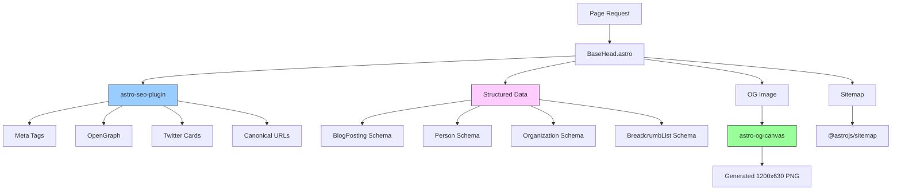

# SEO Implementation

Comprehensive guide to the SEO architecture and implementation for Russ.Cloud blog.

## Overview

The blog implements a comprehensive SEO strategy including meta tags, structured data (JSON-LD), OpenGraph tags, sitemaps, and performance optimization.

## SEO Architecture



## Implemented Features

### Meta Tags & Social Sharing

**Package**: `astro-seo-plugin`

**File**: `src/components/layout/BaseHead.astro`

**Features**:
- Title and description meta tags
- OpenGraph tags (title, description, image, type, URL, siteName)
- Twitter Cards (`summary_large_image`)
- Creator attribution (`@russmckendrick`)
- Canonical URLs
- Keywords meta tags
- Robots directives
- Theme color
- Viewport settings

**Example Output**:
```html
<meta name="description" content="Post description">
<meta property="og:title" content="Post Title">
<meta property="og:description" content="Post description">
<meta property="og:image" content="https://www.russ.cloud/og-image.png">
<meta property="og:type" content="article">
<meta property="og:url" content="https://www.russ.cloud/2024/04/14/post/">
<meta name="twitter:card" content="summary_large_image">
<meta name="twitter:creator" content="@russmckendrick">
<link rel="canonical" href="https://www.russ.cloud/2024/04/14/post/">
```

### Structured Data (JSON-LD)

**Package**: `astro-seo-schema` + `schema-dts`

**File**: `src/utils/schema.ts`

Helpers exported by `src/utils/schema.ts`:

| Helper | Schema type | Used on |
|--------|-------------|---------|
| `createBlogPostingSchema` | `BlogPosting` | All posts (`src/layouts/BlogPost.astro`) |
| `createBreadcrumbSchema` | `BreadcrumbList` | Posts, tag pages, year archives, glossary, author hub, tunes browse pages |
| `createPersonSchema` | `Person` | `/about/`, `/author/russ-mckendrick/` |
| `createOrganizationSchema` | `Organization` | `/about/` |
| `createCollectionPageSchema` | `CollectionPage` (with embedded `ItemList`) | Tag pages, year archives, reading-list tag pages, glossary index, author hub, `/tunes/artist/`, `/tunes/album/` |
| `createMusicAlbumSchema` | `MusicAlbum` | `/tunes/album/[album]/` |
| `createMusicGroupSchema` | `MusicGroup` | `/tunes/artist/[artist]/` |
| `createMusicRecordingSchema` | `MusicRecording` | (Available; not currently wired) |
| `createDefinedTermSchema` | `DefinedTerm` | `/glossary/[term]/` |
| `createBookSchema` | `Book` | `/books/` (one per book; ~14 entries) |
| `createWebSiteSchema` | `WebSite` + `SearchAction` | `/` (homepage only — sitelinks search box) |
| `createFAQSchema` | `FAQPage` | Posts that set `faqs` in frontmatter |
| `createHowToSchema` | `HowTo` | Posts that set `howto` in frontmatter |

#### BlogPosting Schema

Automatically added to all blog posts:

```json
{
  "@context": "https://schema.org",
  "@type": "BlogPosting",
  "headline": "Post Title",
  "description": "Post description",
  "image": "https://www.russ.cloud/og-image.png",
  "datePublished": "2024-04-14T00:00:00.000Z",
  "dateModified": "2024-04-14T00:00:00.000Z",
  "author": {
    "@type": "Person",
    "name": "Russ McKendrick",
    "url": "https://www.russ.cloud/about/"
  },
  "publisher": {
    "@type": "Organization",
    "name": "Russ McKendrick",
    "logo": {
      "@type": "ImageObject",
      "url": "https://www.russ.cloud/images/logo.svg"
    }
  },
  "mainEntityOfPage": {
    "@type": "WebPage",
    "@id": "https://www.russ.cloud/2024/04/14/post/"
  },
  "keywords": "docker, kubernetes, devops"
}
```

#### Person Schema

Added to About page:

```json
{
  "@context": "https://schema.org",
  "@type": "Person",
  "name": "Russ McKendrick",
  "url": "https://www.russ.cloud/about/",
  "image": "https://www.russ.cloud/images/avatar.svg",
  "sameAs": [
    "https://github.com/russmckendrick",
    "https://social.mckendrick.io/@russ",
    "https://www.linkedin.com/in/russmckendrick"
  ],
  "knowsAbout": ["DevOps", "Cloud Computing", "Docker", "Kubernetes", "Azure", "AWS"]
}
```

#### BreadcrumbList Schema

Added to all blog posts:

```json
{
  "@context": "https://schema.org",
  "@type": "BreadcrumbList",
  "itemListElement": [
    {
      "@type": "ListItem",
      "position": 1,
      "name": "Home",
      "item": "https://www.russ.cloud/"
    },
    {
      "@type": "ListItem",
      "position": 2,
      "name": "2024",
      "item": "https://www.russ.cloud/2024/"
    },
    {
      "@type": "ListItem",
      "position": 3,
      "name": "Post Title",
      "item": "https://www.russ.cloud/2024/04/14/post/"
    }
  ]
}
```

### OpenGraph Image Generation

**Package**: `astro-og-canvas`

**Files**:
- Posts: `src/pages/[year]/[month]/[day]/[slug]-og.png.ts`
- Tags: `src/pages/tags/[tag]-og.png.ts`
- Tunes artists: `src/pages/tunes/artist/[artist]-og.png.ts`
- Tunes albums: `src/pages/tunes/album/[album]-og.png.ts`
- Tunes years: `src/pages/tunes/year/[year]-og.png.ts`
- Glossary terms: `src/pages/glossary/[term]-og.png.ts`
- Component: `src/components/OpenGraph/OG.tsx`

The browse-page OG generators all share the same `OG()` + `PNG()` pipeline and an md5-keyed disk cache at `node_modules/.cache/og-images`. Each generator uses a distinct `kind` field in its cache key (`tag`, `tunes-artist`, `tunes-album`, `glossary-term`) so caches do not collide on identical title text. Consumer pages reference the generated PNG via `BaseLayout`'s `image` prop (forwarded into `og:image`).

**Features**:
- Auto-generated for all blog posts
- Dimensions: 1200×630 (standard OG size)
- Design: Site logo, gradient background, blue accent border
- Font: Inter
- Cached: `node_modules/.astro-og-canvas/`

**Generated URLs**:
```
/2024/04/14/post-slug-og.png
```

### Sitemaps

**Package**: `@astrojs/sitemap`

**File**: `astro.config.mjs`

**Features**:
- Auto-generated at build time
- Excludes `/draft/` pages
- Includes `lastmod` dates (extracted from URL)
- Weekly changefreq
- Priority 0.5

**Example Entry**:
```xml
<url>
  <loc>https://www.russ.cloud/2024/04/14/post/</loc>
  <lastmod>2024-04-14T00:00:00.000Z</lastmod>
  <changefreq>weekly</changefreq>
  <priority>0.5</priority>
</url>
```

### robots.txt

**Package**: `astro-robots-txt`

**Generated File**: `public/robots.txt`

```
User-agent: *
Allow: /
Disallow: /draft/
Disallow: /_astro/

Sitemap: https://www.russ.cloud/sitemap-index.xml
```

### RSS Feeds

| Feed | URL | Contents |
|------|-----|----------|
| Main | `/rss.xml` | All blog + tunes, full rendered HTML, 50 most recent |
| Tunes | `/tunes/rss.xml` | Tunes only, descriptions, 50 most recent |
| Per-tag | `/tags/{tag}/rss.xml` | Posts for one tag, descriptions, 30 most recent |

The main feed renders MDX bodies through `experimental_AstroContainer` (see `src/pages/rss.xml.js`). The per-tag and tunes feeds keep generation cheap by serving descriptions only - readers click through for the full post.

### Programmatic SEO browse pages

The site builds programmatic browse hubs from proprietary data instead of just paginating recent posts:

| URL pattern | Source | Schema |
|-------------|--------|--------|
| `/tunes/artist/` and `/tunes/artist/{slug}/[page]/` | `src/data/tunes-index.json` (regenerated by `scripts/build-tunes-index.js`, including local artist images) | `CollectionPage` + `BreadcrumbList` |
| `/tunes/album/` and `/tunes/album/{slug}/` | Same JSON index, including local album images | `MusicAlbum` + `BreadcrumbList` |
| `/glossary/` and `/glossary/{term}/` | `glossary` content collection | `DefinedTerm` + `CollectionPage` |
| `/author/russ-mckendrick/` | All blog posts | `Person` + `CollectionPage` + `BreadcrumbList` |
| `/tags/{tag}/[page]/` (enriched) | `blog` collection + `TAG_METADATA.intro` | `CollectionPage` + `BreadcrumbList`, plus a tag-specific OG image |
| `/books/` | `src/data/books.ts` | `CollectionPage` + `BreadcrumbList` + per-book `Book` |
| `/tunes/year/` and `/tunes/year/{year}/` | `tunes` collection grouped by `pubDate` year; year-in-music essays detected by `{year}-year-in-music` slug | `CollectionPage` + `BreadcrumbList`, plus a tunes-year OG image |

`scripts/build-tunes-index.js` parses the "## Top Albums" section out of each weekly tunes post and writes a sorted index of artists and albums. It records matching image paths from `public/assets/`, preserves actual filename casing for static serving, and merges album variants that resolve to the same artist/title or russ.fm album slug. It runs as part of `pnpm run prebuild` and is also invoked at the end of `pnpm run tunes` so a fresh post immediately appears on the browse hubs.

### Glossary ↔ blog cross-linking

Glossary entries and blog posts share the `tags` axis. Two-way related-content links are derived at build time from that overlap (matched via `normalizeTagSlug` from `src/utils/tags.ts`):

- `/glossary/{term}/` (`src/pages/glossary/[term].astro`) renders a "Posts on this topic" block listing up to 8 most-recent blog posts whose tags intersect the entry's tags.
- Blog posts (`src/layouts/BlogPost.astro`) surface up to 6 glossary terms whose tags intersect the post's tags as a "Glossary" pill rail in the author info box. Tunes posts skip the rail.
- A rehype plugin (`src/utils/rehype-glossary-links.ts`, registered in `astro.config.mjs`) auto-links the **first occurrence** of any glossary term inside MDX body text on every page. Code blocks, headings, existing links, and asides are skipped. The term map is loaded synchronously at config time by `src/utils/glossary-terms.ts`.

Both blocks render only when there is a match — empty intersections produce no UI.

## Content Freshness Signals

### Article Meta Tags

**File**: `src/components/layout/BaseHead.astro`

```html
<meta property="article:published_time" content="2024-04-14T00:00:00.000Z">
<meta property="article:modified_time" content="2024-04-14T00:00:00.000Z">
<meta property="article:author" content="Russ McKendrick">
```

### Reading Time

**Files**:
- Utility: `src/utils/reading-time.ts`
- Component: `src/components/blog/ReadingTime.astro`

**Calculation**: ~200 words per minute

**Display**: "X min read" next to post date

## Internal Linking

### Related Posts

**File**: `src/components/blog/RelatedPosts.astro`

**Algorithm**:
1. Calculate similarity based on shared tags
2. Sort by similarity score
3. Fall back to recent posts if no tag matches
4. Display up to 3 related posts

**Benefits**:
- Improves crawlability
- Distributes PageRank
- Increases time on site
- Reduces bounce rate

### Breadcrumbs

**File**: `src/components/navigation/Breadcrumbs.astro`

**Format**: Home / [Year] / [Post Title]

**Features**:
- Accessible with ARIA labels
- BreadcrumbList JSON-LD schema
- Dark mode support
- Clickable navigation

## Performance Optimization

### Image Optimization

See [Image Delivery Architecture](./image-delivery.md)

- Cloudflare Image Transformations
- Automatic format selection (AVIF → WebP)
- Responsive images with srcset
- Lazy loading (except priority images)

### Font Optimization

**File**: `src/components/layout/BaseHead.astro`

```html
<link rel="preconnect" href="https://fonts.googleapis.com">
<link rel="preconnect" href="https://fonts.gstatic.com" crossorigin>
<link rel="stylesheet" href="https://fonts.googleapis.com/css2?family=Inter:wght@400;600;700&display=swap" media="print" onload="this.media='all'">
```

**Benefits**:
- Async font loading
- No render-blocking CSS
- DNS prefetch for faster connections

### Build Compression

Build-time minification is intentionally not used. Astro/Vite already minify JS and CSS for production, and Cloudflare applies Brotli/gzip at the edge for HTML, JS, and CSS — which delivers far higher savings than whitespace stripping at build time. A `@playform/compress` pass was previously used but added ~10 minutes to CI for negligible byte savings once edge compression was applied.

## Validation & Testing

### Google Rich Results Test

**URL**: https://search.google.com/test/rich-results

**Test**:
1. Deploy site to production
2. Enter blog post URL
3. Verify detected structured data:
   - BlogPosting
   - BreadcrumbList
   - Person (on About page)

### Schema Markup Validator

**URL**: https://validator.schema.org/

**Test**:
1. View page source
2. Copy JSON-LD script content
3. Paste into validator
4. Verify zero errors

### Twitter Card Validator

**URL**: https://cards-dev.twitter.com/validator

**Test**:
1. Enter blog post URL
2. Verify card preview
3. Check image displays correctly
4. Verify title and description

### Lighthouse SEO Audit

**Run via**:
- Chrome DevTools (Lighthouse tab)
- PageSpeed Insights: https://pagespeed.web.dev/

**Target Scores**:
- SEO: 100
- Performance: 95+
- Accessibility: 95+
- Best Practices: 100

### Current Lighthouse Scores

| Category | Score | Notes |
|----------|-------|-------|
| Performance | 98 | Excellent |
| Accessibility | 96 | Very good |
| Best Practices | 100 | Perfect |
| SEO | 100 | Perfect |

## Best Practices

### Unique Descriptions

Always provide unique, descriptive `description` for each post:

```yaml
---
title: "Installing InvokeAI on macOS"
description: "Step-by-step guide to setting up InvokeAI for AI image generation on macOS, including dependencies and configuration."
---
```

**Avoid**:
- Generic descriptions
- Duplicate descriptions
- Missing descriptions

### Image Alt Text

Provide meaningful alt text for all images:

```mdx

```

**Benefits**:
- Accessibility for screen readers
- Image SEO
- Fallback when images fail to load

### Update Dates

Use `lastModified` or `updatedDate` when updating posts:

```yaml
---
title: "Docker Guide"
pubDate: 2024-01-01
lastModified: 2024-04-14
---
```

**Benefits**:
- Signals content freshness to search engines
- Shows users when content was last updated
- Included in sitemap `<lastmod>` tags

### Internal Links

Add contextual internal links to related posts:

```mdx
For more on Docker networking, see [Docker Networking Guide](/2024/03/15/docker-networking/).
```

**Benefits**:
- Helps crawlers discover content
- Distributes PageRank
- Improves user navigation

## Monitoring

### Google Search Console

**Setup**:
1. Verify site ownership: https://search.google.com/search-console
2. Submit sitemap: `https://www.russ.cloud/sitemap-index.xml`
3. Monitor weekly for:
   - Crawl errors
   - Coverage issues
   - Core Web Vitals
   - Search queries and performance

### Plausible Analytics

**Features**:
- Privacy-focused (no cookies)
- GDPR compliant
- Lightweight script
- Real-time data

**Integration**:
Uses Plausible's new hashed script embed format in `BaseHead.astro`:
```html
<script is:inline async src="https://plausible.io/js/pa-1kQuB-9i3FNq-UW5DZix5.js"></script>
<script is:inline>
  window.plausible=window.plausible||function(){(plausible.q=plausible.q||[]).push(arguments)},plausible.init=plausible.init||function(i){plausible.o=i||{}};
  plausible.init()
</script>
```

The `is:inline` directive ensures Astro renders the tags exactly as-is without bundling or converting to modules.

**Metrics**:
- Page views
- Traffic sources
- Top pages
- Bounce rate

**Dashboard**: https://plausible.io/www.russ.cloud

### Cloudflare Analytics

**Metrics**:
- Bandwidth usage
- Requests per day
- Cache hit ratio
- Image transformation usage

**Dashboard**: Cloudflare → Analytics → Web Analytics

## Common Issues

### Low Visibility in Search

**Possible Causes**:
- New content not indexed
- Low-quality content
- Poor internal linking
- Competing with established sites

**Solutions**:
- Submit sitemap to Google Search Console
- Create high-quality, unique content
- Build internal link structure
- Add structured data
- Promote on social media

### Missing Rich Snippets

**Possible Causes**:
- Invalid JSON-LD schema
- Missing required fields
- Schema not detected by Google

**Solutions**:
- Validate with Rich Results Test
- Check for schema errors in Search Console
- Ensure schema is in `<head>` or `<body>`
- Wait for re-indexing (can take days/weeks)

### Images Not Indexing

**Possible Causes**:
- Missing alt text
- Images too large
- robots.txt blocking images

**Solutions**:
- Add descriptive alt text to all images
- Optimize image sizes
- Check robots.txt doesn't disallow images
- Submit image sitemap (optional)

## Future Enhancements

### Potential Improvements

1. **FAQ Schema**: For posts with Q&A sections
2. **HowTo Schema**: For tutorial posts
3. **Video Schema**: If adding video content
4. **Author Profiles**: Individual author pages with Person schema
5. **Related Posts Enhancement**: ML-based recommendations

### Optional Schema Types

#### FAQ Schema

For posts with Q&A sections:

```typescript
import { createFAQSchema } from '../utils/schema';

const faqSchema = createFAQSchema([
  {
    question: "How do I install Docker on Ubuntu?",
    answer: "First update apt with 'sudo apt update'..."
  }
], Astro.url.toString());
```

#### HowTo Schema

For tutorial posts:

```typescript
import { createHowToSchema } from '../utils/schema';

const howToSchema = createHowToSchema({
  name: "Install Docker on Ubuntu",
  description: "Complete guide to installing Docker",
  totalTime: "PT30M",
  steps: [
    { name: "Update apt", text: "Run sudo apt update" },
    { name: "Install Docker", text: "Run sudo apt install docker.io" }
  ]
});
```

## Related Documentation

- [Architecture Overview](./overview.md)
- [Image Delivery](./image-delivery.md)
- [Build & Deployment](./build-deployment.md)

---

**Last Updated**: November 2025
