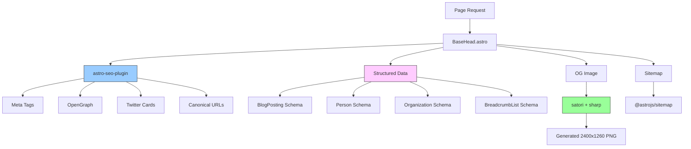

# SEO Implementation

Comprehensive guide to the SEO architecture and implementation for Russ.Cloud blog.

## Overview

The blog implements a comprehensive SEO strategy including meta tags, structured data (JSON-LD), OpenGraph tags, sitemaps, and performance optimization.

## SEO Architecture


```mermaid
graph TD
    A[Page Request] --> B[BaseHead.astro]
    B --> C[astro-seo-plugin]
    C --> D[Meta Tags]
    C --> E[OpenGraph]
    C --> F[Twitter Cards]
    C --> G[Canonical URLs]

    B --> H[Structured Data]
    H --> I[BlogPosting Schema]
    H --> J[Person Schema]
    H --> K[Organization Schema]
    H --> L[BreadcrumbList Schema]

    B --> M[OG Image]
    M --> N[satori + sharp]
    N --> O["Generated 2400x1260 PNG"]

    B --> P[Sitemap]
    P --> Q["@astrojs/sitemap"]

    style C fill:#9cf,stroke:#333
    style H fill:#fcf,stroke:#333
    style N fill:#9f9,stroke:#333
```

## Implemented Features

### Meta Tags & Social Sharing

**Package**: `astro-seo-plugin`

**File**: `src/components/layout/BaseHead.astro`

**Features**:
- Title and description meta tags
- OpenGraph tags (title, description, image, type, URL, siteName)
- Twitter Cards (`summary_large_image`)
- Creator attribution (`@russmckendrick`)
- Canonical URLs
- Keywords meta tags
- Robots directives
- Theme color
- Viewport settings

**Example Output**:
```html
<meta name="description" content="Post description">
<meta property="og:title" content="Post Title">
<meta property="og:description" content="Post description">
<meta property="og:image" content="https://www.russ.cloud/og-image.png">
<meta property="og:type" content="article">
<meta property="og:url" content="https://www.russ.cloud/2024/04/14/post/">
<meta name="twitter:card" content="summary_large_image">
<meta name="twitter:creator" content="@russmckendrick">
<link rel="canonical" href="https://www.russ.cloud/2024/04/14/post/">
```

### Structured Data (JSON-LD)

**Package**: `astro-seo-schema` + `schema-dts`

**File**: `src/utils/schema.ts`

Helpers exported by `src/utils/schema.ts`:

| Helper | Schema type | Used on |
|--------|-------------|---------|
| `createBlogPostingSchema` | `BlogPosting` | All posts (`src/layouts/BlogPost.astro`) |
| `createBreadcrumbSchema` | `BreadcrumbList` | Posts, tag pages, year archives, glossary, author hub, tunes browse pages |
| `createPersonSchema` | `Person` | `/about/`, `/author/russ-mckendrick/` |
| `createOrganizationSchema` | `Organization` | `/about/` |
| `createCollectionPageSchema` | `CollectionPage` (with embedded `ItemList`) | Tag pages, year archives, reading-list tag pages, glossary index, author hub, `/tunes/artist/`, `/tunes/album/` |
| `createMusicAlbumSchema` | `MusicAlbum` | `/tunes/album/[album]/` |
| `createMusicGroupSchema` | `MusicGroup` | `/tunes/artist/[artist]/` |
| `createMusicRecordingSchema` | `MusicRecording` | (Available; not currently wired) |
| `createDefinedTermSchema` | `DefinedTerm` | `/glossary/[term]/` |
| `createBookSchema` | `Book` | `/books/` (one per book; ~14 entries) |
| `createWebSiteSchema` | `WebSite` + `SearchAction` | `/` (homepage only - sitelinks search box) |
| `createFAQSchema` | `FAQPage` | Posts that set `faqs` in frontmatter |
| `createHowToSchema` | `HowTo` | Posts that set `howto` in frontmatter |

#### BlogPosting Schema

Automatically added to all blog posts:

```json
{
  "@context": "https://schema.org",
  "@type": "BlogPosting",
  "headline": "Post Title",
  "description": "Post description",
  "image": "https://www.russ.cloud/og-image.png",
  "datePublished": "2024-04-14T00:00:00.000Z",
  "dateModified": "2024-04-14T00:00:00.000Z",
  "inLanguage": "en-GB",
  "author": {
    "@type": "Person",
    "name": "Russ McKendrick",
    "url": "https://www.russ.cloud/about/"
  },
  "publisher": {
    "@type": "Organization",
    "name": "Russ McKendrick",
    "logo": {
      "@type": "ImageObject",
      "url": "https://www.russ.cloud/images/logo.svg"
    }
  },
  "mainEntityOfPage": {
    "@type": "WebPage",
    "@id": "https://www.russ.cloud/2024/04/14/post/"
  },
  "isPartOf": {
    "@type": "Blog",
    "@id": "https://www.russ.cloud/blog/",
    "name": "Russ McKendrick"
  },
  "keywords": "docker, kubernetes, devops",
  "wordCount": 1234,
  "timeRequired": "PT7M",
  "articleSection": "Docker"
}
```

`wordCount`, `timeRequired` (ISO-8601 duration derived from reading time), and `articleSection` (the post's primary tag display name) are emitted only when their inputs are present, so tunes and tag-less posts omit them. `wordCount` and reading time share one definition via `countWords()` in `src/utils/reading-time.ts`. `inLanguage` defaults to `en-GB` to match the OpenGraph locale.

#### Person Schema

Added to About page:

```json
{
  "@context": "https://schema.org",
  "@type": "Person",
  "name": "Russ McKendrick",
  "url": "https://www.russ.cloud/about/",
  "image": "https://www.russ.cloud/images/avatar.svg",
  "sameAs": [
    "https://github.com/russmckendrick",
    "https://social.mckendrick.io/@russ",
    "https://www.linkedin.com/in/russmckendrick"
  ],
  "knowsAbout": ["DevOps", "Cloud Computing", "Docker", "Kubernetes", "Azure", "AWS"]
}
```

#### BreadcrumbList Schema

Added to all blog posts:

```json
{
  "@context": "https://schema.org",
  "@type": "BreadcrumbList",
  "itemListElement": [
    {
      "@type": "ListItem",
      "position": 1,
      "name": "Home",
      "item": "https://www.russ.cloud/"
    },
    {
      "@type": "ListItem",
      "position": 2,
      "name": "2024",
      "item": "https://www.russ.cloud/2024/"
    },
    {
      "@type": "ListItem",
      "position": 3,
      "name": "Post Title",
      "item": "https://www.russ.cloud/2024/04/14/post/"
    }
  ]
}
```

### OpenGraph Image Generation

**Packages**: `satori` (JSX to SVG) + `sharp` (SVG to PNG)

**Files**:
- Posts: `src/pages/[year]/[month]/[day]/[slug]-og.png.ts`
- Tags: `src/pages/tags/[tag]-og.png.ts`
- Tunes artists: `src/pages/tunes/artist/[artist]-og.png.ts`
- Tunes albums: `src/pages/tunes/album/[album]-og.png.ts`
- Tunes years: `src/pages/tunes/year/[year]-og.png.ts`
- Glossary terms: `src/pages/glossary/[term]-og.png.ts`
- Books: `src/pages/books/[slug]-og.png.ts`
- Archives: `src/pages/archives-og.png.ts`
- Homepage: `src/pages/home-og.png.ts` — no rubric, since the homepage is not a section of the site. Its art riffs on the masthead mark: an all-in-one monitor wearing a pair of spectacles.

The last two back single static pages rather than a dynamic route, so their title lives in the route file and the page points `BaseLayout`'s `image` prop at the generated URL (`/archives-og.png`, `/home-og.png`) instead of receiving it through `getStaticPaths` props.
- Component: `src/components/OpenGraph/OG.tsx`
- Tunes card: `src/components/OpenGraph/TunesRecord.tsx`
- Shared palette, lockup and path resolution: `src/components/OpenGraph/cardChrome.tsx`
- Rasteriser: `src/components/OpenGraph/createImage.ts`
- Card geometry: `src/components/OpenGraph/dimensions.ts`
- Section artwork: `src/images/opengraph/sections/*.png`

The browse-page OG generators all share the same `PNG()` rasteriser and an md5-keyed disk cache at `node_modules/.cache/og-images`. Each generator uses a distinct `kind` field in its cache key (`tag`, `tunes-artist`, `tunes-album`, `glossary-term`) so caches do not collide on identical title text. Consumer pages reference the generated PNG via `BaseLayout`'s `image` prop (forwarded into `og:image`).

`OG(title, description, options)` renders one of two cards:

- **Scrim** — when `options.coverImagePath` resolves. The cover fills the frame behind a vertical and a horizontal gradient in the Night edition's paper (`rgba(22, 20, 17, …)`), with the brand lockup reversed out top-left and the headline and rubric at the foot. Covers are 2560×1440, so a 1.91:1 frame keeps roughly 93% of the art.
- **Plate** — the coverless fallback. Warm paper ground, lockup, ink headline, mist standfirst, and a hairline above the section rubric. Nothing routes to it today; it stands as the graceful degradation if a cover file goes missing.

**Album and artist pages get a third card.** `TunesRecord(name, options)` draws the sleeve on paper with the record sliding out from behind it, and the words in the column the disc stops short of. Album pages put the album art on the sleeve and the artist's portrait on the record label; artist pages invert that — portrait on the sleeve, and on the label whichever of their albums has appeared in the most weekly posts (ties break on slug, so the choice is stable across builds). Where the second image is missing the sleeve art is reused for the label.

Both images come from `image` fields in `src/data/tunes-index.json`, which are **site-root URL paths**, not filesystem paths. Resolve them with `resolvePublicAsset` rather than `resolveCoverPath`: the latter treats a leading slash as filesystem-absolute, so a `/assets/…` path sends it looking at the top of the disk, where it silently finds nothing and the card drops to the fallback.

`TunesRecord` returns `undefined` when it cannot read the sleeve art, which is the route's signal to fall back to the section-cover Scrim. 68 albums and 26 artists in the index have no image at all and take that path. The card's geometry constants are load-bearing: the text column is positioned off the right edge of the card rather than laid out beside the disc, so widening `DISC` pushes the record under the headline instead of reflowing anything.

The cache key folds in `artDigest([artPath, labelPath])` — an md5 of the image bytes themselves. `scripts/backfill-tunes-images.js` refetches this artwork, and without the digest a replaced cover leaves every card built from it stale; the card still renders and still looks right, so the mistake only surfaces once it ships.

**Hub routes use section artwork.** Tag, book, glossary and tunes-year hubs have no cover of their own, and a wall of identical paper Plates made the browse pages the dullest thing shared off the site. Each section instead points at one shared image in `src/images/opengraph/sections/` — so all 28 tag hubs share `tags.png`, every book hub shares `books.png`, and so on — which puts them on the Scrim card alongside posts. The images are generated with `scripts/generate-cover.js --prompt=… --output=…` and committed (delete the `-small.png` variant the script also writes; nothing reads it).

Routes resolve theirs through `sectionCover(name)` in `src/components/OpenGraph/sectionCover.ts`, which returns the absolute path plus an md5 of the file's bytes. **Fold that digest into the cache key** — every route does. Without it, regenerating a section image leaves the whole section's cards stale: they look identical to the old ones and nothing fails, so the mistake only surfaces once it ships.

Section art is furniture, not post art, so it is briefed against the scrim rather than for its own sake: interest right of centre and mid-height, the left third dark and quiet under the headline, mid-to-dark tonality throughout, and nothing critical in the top or bottom 3% (a 16:9 source centre-crops to 1.905:1). The usual cover defect guards still apply — no text anywhere, and any prop that normally carries lettering must be described as blank and unmarked, since a card-catalogue drawer or a book spine is exactly what the image model will scrawl gibberish on. Source images that are already low-key come out as a murky rectangle once the scrim lands on them; brief for a lit subject and let the scrim do the darkening.

**The description is only baked into the Plate.** Every platform prints `og:description` as text beneath the card, so repeating it over the artwork said the same thing twice. Post cards carry a rubric instead — date · reading time · lead tag — which is information the platforms do not duplicate. Hub routes pass their own one-word rubric (`Tag`, `Books`, `Glossary`, `Album`, `Artist`, `Tunes`, `Archive`) through `options.meta`. Now that hubs render as Scrim cards, their descriptions are dropped from the artwork too. The tunes record card has room for more and carries the full rubric — the artist or album count, then the post count and `Listened to This Week`.

**Features**:
- Auto-generated for all blog posts
- Layout box: 1200×630 (standard OG size), rasterised at `OG_SCALE` (currently 2) for 2400×1260 output. `BaseHead.astro` reads the same constants for `og:image:width`/`height`, so the declared size cannot drift from the rendered one. Satori draws text as vector paths, so only the embedded cover is supplied at the scaled size. Cards are roughly 3.4x heavier at 2 than at 1 (photographic cards land ~1.4–2MB, inside the 5MB ceiling X applies to shared images); `dimensions.ts` is the single dial.
- Design: Reading Room — paper `#FBFAF7`, ink `#1E1C18`, mist `#6F6A61`, hairline `#ECE8E1`. Emoji are stripped from titles and descriptions (satori ships no emoji font).
- Brand: the masthead lockup is rebuilt as an inline SVG from `src/data/logo-lockup.json`, the same generated file `Logo.astro` reads. On paper the mark keeps its own palette; over photography it reverses to a flat white monitor — the cloud artwork is dropped there because at 32px any contrast between the two cloud shapes reads as a pair of spectacles.
- Fonts: Schibsted Grotesk 400/500/700 as static TTFs in `src/images/opengraph/fonts/`. Satori reads TTF/OTF only, and renders a variable font at its default instance, so these are cut from `src/assets/fonts/schibsted-grotesk-variable-latin.woff2` with fontTools — see the recipe in `createImage.ts`. **`GPOS` is stripped**: satori misapplies kern pairs involving the space glyph, which opens a visible double gap after words ending in `n` ("Token Use" renders as "Token  Use"). Kerning is no loss at display sizes.
- Encoding: truecolour PNG. Quantising saves under 5% on scrim cards while dithering the semi-transparent wordmark into visible speckle.
- Cached: `node_modules/.cache/og-images/`, keyed by content **plus a design-version salt** in every `*-og.png.ts` route (`og-design:reading-room-scrim-v2`, and `og-design:tunes-record-v1` on the two tunes entity routes) — bump the salt after any OG redesign. Source-image swaps invalidate themselves through a byte digest and need no bump: `sectionCover`'s for section art, `artDigest`'s for album and artist artwork. Otherwise CI's cached `node_modules` will keep serving old renders

**Generated URLs**:
```
/2024/04/14/post-slug-og.png
```

### Sitemaps

**Package**: `@astrojs/sitemap`

**File**: `astro.config.mjs`

**Features**:
- Auto-generated at build time
- Excludes `/draft/` and `/avatars/` pages
- Includes accurate `lastmod` dates: the `serialize` callback looks each post URL up in a precomputed map (`getPostModifiedDateMap()` in `src/utils/post-dates.ts`) and uses the post's real `lastModified ?? updatedDate ?? pubDate`, so revised posts signal freshness. URLs not in the map (or non-post routes) fall back to the publish date parsed from the `/YYYY/MM/DD/` URL pattern.
- Weekly changefreq
- Priority 0.5

The map is built synchronously at config-load time (the same pattern `getGlossaryTermMap()` uses) by reading blog and tunes frontmatter and reconstructing each post's pathname via `getPostUrl()` from `src/utils/url.ts`.

**Example Entry**:
```xml
<url>
  <loc>https://www.russ.cloud/2024/04/14/post/</loc>
  <lastmod>2024-04-14T00:00:00.000Z</lastmod>
  <changefreq>weekly</changefreq>
  <priority>0.5</priority>
</url>
```

### robots.txt

**Package**: `astro-robots-txt`

**Generated File**: `public/robots.txt`

```
User-agent: *
Allow: /
Disallow: /draft/
Disallow: /_astro/

Sitemap: https://www.russ.cloud/sitemap-index.xml
```

### RSS Feeds

| Feed | URL | Contents |
|------|-----|----------|
| Main | `/rss.xml` | All blog + tunes, full rendered HTML, 50 most recent |
| Tunes | `/tunes/rss.xml` | Tunes only, descriptions, 50 most recent |
| Per-tag | `/tags/{tag}/rss.xml` | Posts for one tag, descriptions, 30 most recent |

The main feed renders MDX bodies through `experimental_AstroContainer` (see `src/pages/rss.xml.js`). The per-tag and tunes feeds keep generation cheap by serving descriptions only - readers click through for the full post.

### Programmatic SEO browse pages

The site builds programmatic browse hubs from proprietary data instead of just paginating recent posts:

| URL pattern | Source | Schema |
|-------------|--------|--------|
| `/tunes/artist/` and `/tunes/artist/{slug}/[page]/` | `src/data/tunes-index.json` (regenerated by `scripts/build-tunes-index.js`, including local artist images) | `CollectionPage` + `BreadcrumbList` |
| `/tunes/album/` and `/tunes/album/{slug}/` | Same JSON index, including local album images | `MusicAlbum` + `BreadcrumbList` |
| `/glossary/` and `/glossary/{term}/` | `glossary` content collection | `DefinedTerm` + `CollectionPage` |
| `/author/russ-mckendrick/` | All blog posts | `Person` + `CollectionPage` + `BreadcrumbList` |
| `/tags/{tag}/[page]/` (enriched) | `blog` collection + `TAG_METADATA.intro` | `CollectionPage` + `BreadcrumbList`, plus a tag-specific OG image |
| `/books/` | `src/data/books.ts` | `CollectionPage` + `BreadcrumbList` + per-book `Book` |
| `/tunes/year/` and `/tunes/year/{year}/` | `tunes` collection grouped by `pubDate` year; year-in-music essays detected by `{year}-year-in-music` slug | `CollectionPage` + `BreadcrumbList`, plus a tunes-year OG image |

`scripts/build-tunes-index.js` parses the "## Top Albums" section out of each weekly tunes post and writes a sorted index of artists and albums. It records matching image paths from `public/assets/`, preserves actual filename casing for static serving, and merges album variants that resolve to the same artist/title or russ.fm album slug. It runs as part of `pnpm run prebuild` and is also invoked at the end of `pnpm run tunes` so a fresh post immediately appears on the browse hubs.

### Glossary ↔ blog cross-linking

Glossary entries and blog posts share the `tags` axis. Two-way related-content links are derived at build time from that overlap (matched via `normalizeTagSlug` from `src/utils/tags.ts`):

- `/glossary/{term}/` (`src/pages/glossary/[term].astro`) renders a "Posts on this topic" block listing up to 8 most-recent blog posts whose tags intersect the entry's tags.
- Blog posts (`src/layouts/BlogPost.astro`) surface up to 6 glossary terms whose tags intersect the post's tags as a "Glossary" list in the right-hand sidebar, below the sticky table of contents (`StickyGlossary.astro`, shown on 2xl viewports and up). Tunes posts skip the list.
- A rehype plugin (`src/utils/rehype-glossary-links.ts`, registered in `astro.config.mjs`) auto-links the **first occurrence** of any glossary term inside MDX body text on every page. Code blocks, headings, existing links, and asides are skipped. The term map is loaded synchronously at config time by `src/utils/glossary-terms.ts`.

Both blocks render only when there is a match - empty intersections produce no UI.

## Content Freshness Signals

### Article Meta Tags

**File**: `src/components/layout/BaseHead.astro`

```html
<meta property="article:published_time" content="2024-04-14T00:00:00.000Z">
<meta property="article:modified_time" content="2024-04-14T00:00:00.000Z">
<meta property="article:author" content="Russ McKendrick">
```

### Reading Time

**Files**:
- Utility: `src/utils/reading-time.ts`
- Component: `src/components/blog/ReadingTime.astro`

**Calculation**: ~200 words per minute

**Display**: "X min read" next to post date

## Internal Linking

### Related Posts

**File**: `src/components/blog/RelatedPosts.astro`

**Algorithm**:
1. Calculate similarity based on shared tags
2. Sort by similarity score
3. Fall back to recent posts if no tag matches
4. Display up to 3 related posts

**Benefits**:
- Improves crawlability
- Distributes PageRank
- Increases time on site
- Reduces bounce rate

### Breadcrumbs

**File**: `src/components/navigation/Breadcrumbs.astro`

**Format**: Home / [Year] / [Post Title]

**Features**:
- Accessible with ARIA labels
- BreadcrumbList JSON-LD schema
- Dark mode support
- Clickable navigation

## Performance Optimization

### Image Optimization

See [Image Delivery Architecture](./image-delivery.md)

- Cloudflare Image Transformations
- Automatic format selection (AVIF → WebP)
- Responsive images with srcset
- Lazy loading (except priority images)

### Font Optimization

**File**: `src/components/layout/BaseHead.astro`

Fonts are self-hosted via Astro's Fonts API (no Google Fonts requests). The two families - Source Serif 4 (display and body) and IBM Plex Mono (code/metadata) - are loaded as CSS variables:

```astro
<Font cssVariable="--font-fraunces" />
<Font cssVariable="--font-source-serif" />
<Font cssVariable="--font-ibm-plex-mono" />
```

**Benefits**:
- Self-hosted, no third-party font requests
- `font-display: swap` with Astro's fallback metrics (zero CLS)
- No font preload - the LCP element is the hero image, so fonts stay off the critical path

### Build Compression

Build-time minification is intentionally not used. Astro/Vite already minify JS and CSS for production, and Cloudflare applies Brotli/gzip at the edge for HTML, JS, and CSS - which delivers far higher savings than whitespace stripping at build time. A `@playform/compress` pass was previously used but added ~10 minutes to CI for negligible byte savings once edge compression was applied.

## Validation & Testing

### Google Rich Results Test

**URL**: https://search.google.com/test/rich-results

**Test**:
1. Deploy site to production
2. Enter blog post URL
3. Verify detected structured data:
   - BlogPosting
   - BreadcrumbList
   - Person (on About page)

### Schema Markup Validator

**URL**: https://validator.schema.org/

**Test**:
1. View page source
2. Copy JSON-LD script content
3. Paste into validator
4. Verify zero errors

### Twitter Card Validator

**URL**: https://cards-dev.twitter.com/validator

**Test**:
1. Enter blog post URL
2. Verify card preview
3. Check image displays correctly
4. Verify title and description

### Lighthouse SEO Audit

**Run via**:
- Chrome DevTools (Lighthouse tab)
- PageSpeed Insights: https://pagespeed.web.dev/

**Target Scores**:
- SEO: 100
- Performance: 95+
- Accessibility: 95+
- Best Practices: 100

### Current Lighthouse Scores

| Category | Score | Notes |
|----------|-------|-------|
| Performance | 98 | Excellent |
| Accessibility | 96 | Very good |
| Best Practices | 100 | Perfect |
| SEO | 100 | Perfect |

## Best Practices

### Unique Descriptions

Always provide unique, descriptive `description` for each post:

```yaml
---
title: "Installing InvokeAI on macOS"
description: "Step-by-step guide to setting up InvokeAI for AI image generation on macOS, including dependencies and configuration."
---
```

**Avoid**:
- Generic descriptions
- Duplicate descriptions
- Missing descriptions

### Image Alt Text

Provide meaningful alt text for all images:

```mdx

```

**Benefits**:
- Accessibility for screen readers
- Image SEO
- Fallback when images fail to load

### Update Dates

Use `lastModified` or `updatedDate` when updating posts:

```yaml
---
title: "Docker Guide"
pubDate: 2024-01-01
lastModified: 2024-04-14
---
```

**Benefits**:
- Signals content freshness to search engines
- Shows users when content was last updated
- Included in sitemap `<lastmod>` tags

### Internal Links

Add contextual internal links to related posts:

```mdx
For more on Docker networking, see [Docker Networking Guide](/2024/03/15/docker-networking/).
```

**Benefits**:
- Helps crawlers discover content
- Distributes PageRank
- Improves user navigation

## Monitoring

### Google Search Console

**Setup**:
1. Verify site ownership: https://search.google.com/search-console
2. Submit sitemap: `https://www.russ.cloud/sitemap-index.xml`
3. Monitor weekly for:
   - Crawl errors
   - Coverage issues
   - Core Web Vitals
   - Search queries and performance

### Plausible Analytics

**Features**:
- Privacy-focused (no cookies)
- GDPR compliant
- Lightweight script
- Real-time data

**Script format** (the October 2025 change):
Plausible replaced the shared `script.js` with a **per-site snippet** (`/js/pa-XXXX.js`, filename in
Site Settings → Site Installation), and moved optional measurements from chained filenames
(`script.tagged-events.outbound-links.js`) to **`plausible.init({ ... })`**. This site is already on
that format — there is no migration outstanding. The legacy URLs still return 200, so older guides
aren't *wrong*, just superseded. Two things the per-site script bakes in that are easy to trip over:

- `domain` is compiled into the script (`russ.cloud`) and `Object.assign` forces it back afterwards,
  so passing `domain` to `init()` does nothing.
- `outboundLinks` already defaults to `true` in our build; the explicit flag below is redundant but
  harmless, and keeps the intent readable.

**First-party delivery**:
Both halves are proxied through our own origin by `worker/index.js` — nothing in the page references
`plausible.io`. Proxying only the script would be pointless: the script POSTs to the event endpoint,
and *that* request is what content blockers actually drop.

| Path | Proxied to | Notes |
|------|-----------|-------|
| `/js/pa.js` | `https://plausible.io/js/pa-1kQuB-9i3FNq-UW5DZix5.js` | Edge-cached 6h (`cacheEverything`) |
| `/api/event` | `https://plausible.io/api/event` | POST only; 405 otherwise |

The event proxy sends only the three headers the Events API reads — `Content-Type`, `User-Agent`
(which drives the unique-visitor hash) and `X-Forwarded-For`. **`X-Forwarded-For` is set from
`CF-Connecting-IP` and is not optional**: a Worker subrequest originates from Cloudflare, so without
it Plausible sees an edge IP, its bot filter silently drops the event, *and it still answers 202* —
the failure is invisible. Cookies and `Referer` are deliberately not forwarded.

**Integration** in `BaseHead.astro`. `init()` enables outbound-link and file-download tracking, and
reads pageview custom properties from `<meta name="plausible:*">` tags via a function (a function is
required because View Transitions reuse the loaded script across client-side navigations, so a static
props object would go stale):
```html
<!-- One <meta> per analytics prop, emitted from the layout (see below) -->
<meta name="plausible:content_type" content="blog" />
<script is:inline async src="/js/pa.js"></script>
<script is:inline>
  window.plausible=window.plausible||function(){(plausible.q=plausible.q||[]).push(arguments)},plausible.init=plausible.init||function(i){plausible.o=i||{}};
  plausible.init({
    endpoint: '/api/event',
    outboundLinks: true,
    fileDownloads: true,
    customProperties: () => Object.fromEntries(
      [...document.querySelectorAll('meta[name^="plausible:"]')]
        .map((m) => [m.getAttribute('name').slice(9), m.getAttribute('content')])
    )
  })
</script>
```

`endpoint` is what points the script at the proxy. It's resolved with `fetch()`, so a root-relative
path stays same-origin. The `is:inline` directive ensures Astro renders the tags exactly as-is
without bundling or converting to modules.

**Production-only**: the tags are wrapped in `import.meta.env.PROD`, because `/js/pa.js` and
`/api/event` exist only in the Worker — `astro dev` would 404 on them. Nothing is lost, as Plausible's
`captureOnLocalhost` defaults to `false`. To exercise the real proxy locally run
`pnpm run preview:worker` (`astro build && wrangler dev`); `astro dev` and `astro preview` do not run
the Worker. All `window.plausible?.(...)` call sites are optional-chained, so they no-op in dev.

**Pageview custom properties**: `BaseHead.astro` accepts an `analytics?: Record<string,string>` prop
and renders each key as a `<meta name="plausible:KEY">` tag (defaulting to `content_type: 'page'`).
`BlogPost.astro` passes `content_type` (`blog`/`tunes`), `primary_tag`, `author`, and
`published_year`, so traffic can be segmented by these in the Plausible *Properties* breakdown.

**Custom event goals** (create matching goals in the Plausible dashboard, and enable Outbound Links /
File Downloads / Custom Events under Site Settings):
- `Share` (prop `method`) — share-button clicks, tagged via `plausible-event-*` classes in
  `ShareButtons.astro`.
- `Search` — fired (debounced, no query string) from `src/pages/search.astro`.
- `Comments Viewed` — fired when Giscus scrolls into view in `Comments.astro`.
- `Video Play` (prop `provider`) — fired on first click of a YouTube embed in `embeds/YouTube.astro`.
- `404` — fired from `src/pages/404.astro` with the missing `path`.

**Metrics**:
- Page views (with content-type / tag / author / year properties)
- Traffic sources
- Top pages
- Bounce rate
- Outbound link clicks and file downloads
- Custom goals: Share, Search, Comments Viewed, Video Play, 404

**Dashboard**: https://plausible.io/www.russ.cloud

### Cloudflare Analytics

**Metrics**:
- Bandwidth usage
- Requests per day
- Cache hit ratio
- Image transformation usage

**Dashboard**: Cloudflare → Analytics → Web Analytics

## Common Issues

### Low Visibility in Search

**Possible Causes**:
- New content not indexed
- Low-quality content
- Poor internal linking
- Competing with established sites

**Solutions**:
- Submit sitemap to Google Search Console
- Create high-quality, unique content
- Build internal link structure
- Add structured data
- Promote on social media

### Missing Rich Snippets

**Possible Causes**:
- Invalid JSON-LD schema
- Missing required fields
- Schema not detected by Google

**Solutions**:
- Validate with Rich Results Test
- Check for schema errors in Search Console
- Ensure schema is in `<head>` or `<body>`
- Wait for re-indexing (can take days/weeks)

### Images Not Indexing

**Possible Causes**:
- Missing alt text
- Images too large
- robots.txt blocking images

**Solutions**:
- Add descriptive alt text to all images
- Optimize image sizes
- Check robots.txt doesn't disallow images
- Submit image sitemap (optional)

## Future Enhancements

### Potential Improvements

1. **FAQ Schema**: For posts with Q&A sections
2. **HowTo Schema**: For tutorial posts
3. **Video Schema**: If adding video content
4. **Author Profiles**: Individual author pages with Person schema
5. **Related Posts Enhancement**: ML-based recommendations

### Optional Schema Types

#### FAQ Schema

For posts with Q&A sections:

```typescript
import { createFAQSchema } from '../utils/schema';

const faqSchema = createFAQSchema([
  {
    question: "How do I install Docker on Ubuntu?",
    answer: "First update apt with 'sudo apt update'..."
  }
], Astro.url.toString());
```

#### HowTo Schema

For tutorial posts:

```typescript
import { createHowToSchema } from '../utils/schema';

const howToSchema = createHowToSchema({
  name: "Install Docker on Ubuntu",
  description: "Complete guide to installing Docker",
  totalTime: "PT30M",
  steps: [
    { name: "Update apt", text: "Run sudo apt update" },
    { name: "Install Docker", text: "Run sudo apt install docker.io" }
  ]
});
```

## Related Documentation

- [Architecture Overview](./overview.md)
- [Image Delivery](./image-delivery.md)
- [Build & Deployment](./build-deployment.md)

---

**Last Updated**: May 2026
